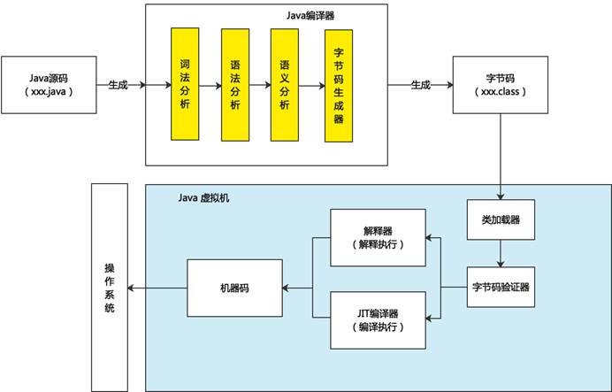
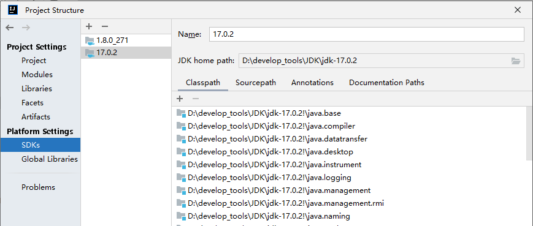
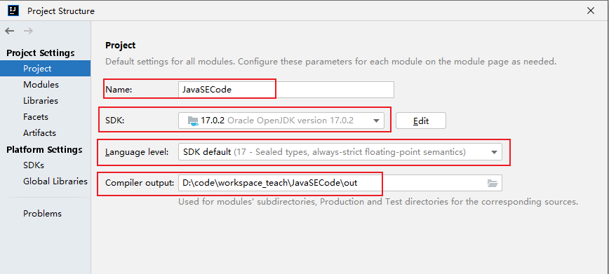
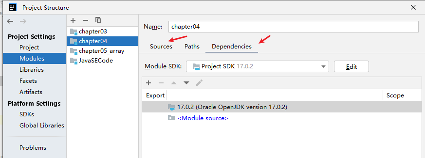
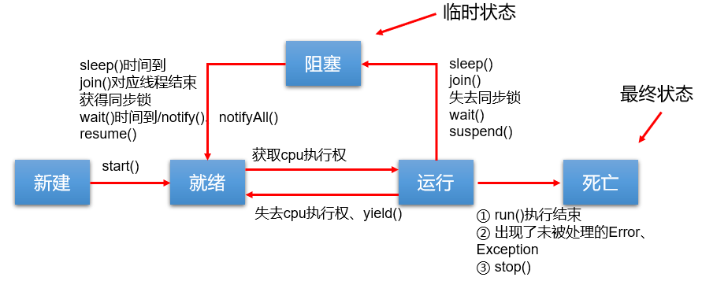
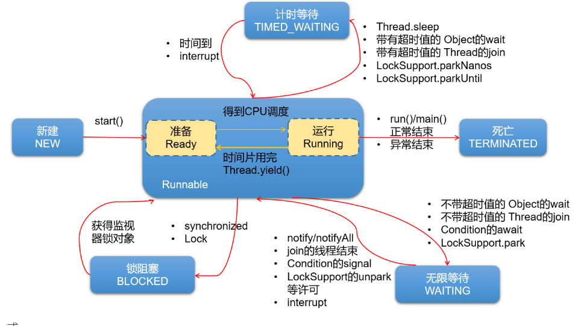
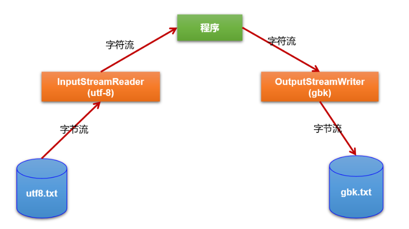
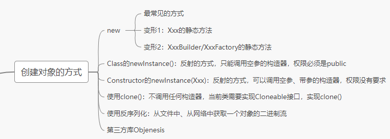

# Java基础知识复习 & 真题（尚硅谷·宋红康）

> 本电子书由 18 章「随堂复习与企业真题」Markdown 合并生成。所有原始 `images/` 路径已重写至 `assets/images/`。


## 目录

- [第01章 Java语言概述](#第01章-Java语言概述)
- [第02章 变量与运算符](#第02章-变量与运算符)
- [第03章 流程控制语句](#第03章-流程控制语句)
- [第04章 IDEA的安装与使用](#第04章-IDEA的安装与使用)
- [第05章 数组](#第05章-数组)
- [第06章 面向对象-基础](#第06章-面向对象-基础)
- [第07章 面向对象-进阶](#第07章-面向对象-进阶)
- [第08章 面向对象-高级](#第08章-面向对象-高级)
- [第09章 异常处理](#第09章-异常处理)
- [第10章 多线程](#第10章-多线程)
- [第11章 常用类与基础API](#第11章-常用类与基础API)
- [第12章 集合框架](#第12章-集合框架)
- [第13章 泛型](#第13章-泛型)
- [第14章 数据结构与集合源码](#第14章-数据结构与集合源码)
- [第15章 File类与IO流](#第15章-File类与IO流)
- [第16章 网络编程](#第16章-网络编程)
- [第17章 反射机制](#第17章-反射机制)
- [第18章 JDK8-17新特性](#第18章-JDK8-17新特性)

---


<a id="第01章-Java语言概述"></a>


# 第01章 Java语言概述


***

### 一、随堂复习

#### 1. Java基础全程的学习内容

```
第1阶段：Java基本语法
> Java概述、关键字、标识符、变量、运算符、流程控制（条件判断、选择结构、循环结构）、IDEA、数组

第2阶段：Java面向对象编程
> 类及类的内部成员
> 面向对象的三大特征
> 其它关键字的使用

第3阶段：Java语言的高级应用
> 异常处理、多线程、IO流、集合框架、反射、网络编程、新特性、其它常用的API等

```

神书：《Java核心技术》、《Effective Java》、《Java编程思想》

#### 2. 软件开发相关内容

##### 2.1 计算机的构成

硬件 + 软件 

##### 2.2 软件

软件，即一系列按照`特定顺序组织`的计算机`数据`和`指令`的集合。有**系统软件**和**应用软件**之分。

- 系统软件，即操作系统，windows、Mac os 、linux、android、ios
- 应用软件，即os之上的应用程序。

##### 2.3 人机交互方式

- 图形化界面（GUI）
- 命令行交互方式（CLI）
  - 熟悉常用的dos命令：dir 、 cd 、cd.. 、 cd/  cd\ 、md、rd等

##### 2.4 计算机编程语言

- 语言的分代：
  - 第1代：机器语言
  - 第2代：汇编语言
  - 第3代：高级语言
    - 面向过程的语言：C
    - 面向对象的语言：C++、Java、C#、Python、Go、JavaScript

- **没有“最好”的语言**，只有在特定场景下相对来说，最适合的语言而已。

#### 3. Java概述

##### 3.1 Java发展史

- 几个重要的版本：1996年，发布JDK1.0; 里程碑式的版本：JDK5.0、JDK8.0(2014年发布)

  ​                                JDK11（LTS）、JDK17（LTS）long term support

##### 3.2 Java 之父

詹姆斯·高斯林

#### 3.3 Java具体的平台划分

J2SE --->JavaSE

J2EE ---->JavaEE

J2ME ---> JavaME

Java目前主要的应用场景：JavaEE后台开发、Android客户端的开发、大数据的开发

#### 4. Java环境的搭建

- JDK、JRE、JVM三者之间的关系
- JDK的下载（官网）
- JDK的安装
  - 安装jdk8 和 jdk17
- 环境变量的配置（重要）

#### 5. HelloWorld的编写和常见问题的解决（重点）

- 第1个程序

```java
class HelloChina{
	public static void main(String[] args){
		System.out.println("hello,world!!你好，中国！");
		System.out.print("hello,world!!你好，中国！");
		System.out.println("123abc");
		System.out.println(123 + 1);
	}
}
```

- 测试程序

```java
public class HelloJava{
	public static void main(String[] args){
		System.out.println("hello");
		System.out.println(10/0);
	}
}


class HelloShangHai{

}

class HelloBeijing{

}


```

- 小结

```

总结：
1. Java程序编写和执行的过程：
步骤1：编写。将Java代码编写在.java结尾的源文件中
步骤2：编译。针对于.java结尾的源文件进行编译操作。 格式：javac 源文件名.java
步骤3：运行。针对于编译后生成的字节码文件，进行解释运行。 格式： java 字节码文件名


2. 针对于步骤1的编写进行说明。

class HelloChina{
	public static void main(String[] args){
		System.out.println("hello,world!!你好，中国！");
	}
}

其中，
① class:关键字，表示"类"，后面跟着类名。
② main()方法的格式是固定的。务必记住！表示程序的入口
  public static void main(String[] args)  

如果非要有些变化的话，只能变化String[] args结构。可以写成：方式1：String args[]   方式2：String[] a

args:全程是arguments，简写成args

③ Java程序，是严格区分大小写的。

④ 从控制台输出数据的操作：
System.out.println() : 输出数据之后，会换行。
System.out.print() : 输出数据之后，不会换行。


⑤ 每一行执行语句必须以;结束。


3. 针对于步骤2的编译进行说明。

① 如果编译不通过。可以考虑的问题：
问题1：查看编译的文件名、文件路径是否书写错误
问题2：查看代码中是否存在语法问题。如果存在，就可能导致编译不通过。

② 编译以后，会生成1个或多个字节码文件。每一个字节码文件对应一个Java类，并且字节码文件名与类名相同。


4. 针对于步骤3运行进行说明。

① 我们是针对于字节码文件对应的Java类进行解释运行的。
要注意区分大小写！

② 如果运行不通过。可以考虑的问题：
问题1：查看解释运行的的类名、字节码文件路径是否书写错误
问题2：可能存在运行时异常。（放到第9章中具体讲解）


5. 一个源文件中可以声明多个类，但是最多只能有一个类使用public进行声明。
且要求声明为public的类的类名与源文件名相同。
```

#### 6. 注释的使用

```java

/*
这是多行注释。

我们可以声明多行注释的信息！


1. Java中的注释的种类：
单行注释 、 多行注释 、 文档注释（Java特有）

2. 单行注释、多行注释的作用：
① 对程序中的代码进行解释说明
② 对程序进行调试

3. 注意：
① 单行注释和多行注释中声明的信息，不参与编译。换句话说，编译以后声明的字节码文件中不包含单行注释和
多行注释中的信息。
② 多行注释不能嵌套使用

4. 文档注释:
文档注释内容可以被JDK提供的工具 javadoc 所解析，生成一套以网页文件形式体现的该程序的说明文档。

*/
/**
这是我的第一个Java程序。很开森！^_^

@author shkstart
@version 1.0

*/
public class CommentTest{
	/**
	这是main()方法。格式是固定的。(文档注释)
	*/
	/*
	这是main()方法。格式是固定的。(多行注释)
	*/
	public static void main(String[] args){
		//这是输出语句
		System.out.println("hello,world!!");
		//System.out.println("hello,world!!")
	}
}
```

#### 7. API文档

#### 8. 练习

- 练习1

```java
class PersonalInfo{
	public static void main(String[] args) {
	    System.out.println("姓名：康师傅");
		System.out.println(); //换行的操作
		System.out.println("性别：男");
		System.out.println("家庭住址：北京程序员聚集地：回龙观");
	}
}

```


- 练习2

```java
class StarPrintTest {
	public static void main(String[] args) {
		System.out.println("*    *");
		System.out.println("*\t\t*");
		System.out.println("*\n\n*");
	}
}

```


### 二、企业真题

#### 1.一个”.java”源文件中是否可以包括多个类？有什么限制(明*数据)

是！

一个源文件中可以声明多个类，但是最多只能有一个类使用public进行声明。
且要求声明为public的类的类名与源文件名相同。

#### 2.Java 的优势（阿**巴）

- 跨平台型
- 安全性高
- 简单性
- 高性能
- 面向对象性
- 健壮性


#### 3.常用的几个命令行操作都有哪些？(至少4个)（北京数字**）

略

#### 4.Java 中是否存在内存溢出、内存泄漏？如何解决？举例说明（拼*多）

存在！

不能举例。

#### 5. 如何看待Java是一门半编译半解释型的语言（携*）




<a id="第02章-变量与运算符"></a>


# 第02章 变量与运算符


***

### 一、随堂复习

#### 1.1 关键字、保留字

- 关键字：被Java赋予特殊含义的字符串。
  - 官方规范中有50个关键字
  - true、false、null虽然不是关键字，但是可以当做关键字来看待。

- 保留字：goto 、 const

#### 1.2 标识符

- 标识符：凡是可以自己命名的地方，都是标识符。
  - 比如：类名、变量名、方法名、接口名、包名、常量名等
- 记住：标识符命名的规则（必须要遵守的，否则编译不通过）

```
> 由26个英文字母大小写，0-9 ，_或 $ 组成
> 数字不可以开头。
> 不可以使用关键字和保留字，但能包含关键字和保留字。
> Java中严格区分大小写，长度无限制。
> 标识符不能包含空格。
```

- 记住：标识符命名的规范（建议遵守。如果不遵守，编译和运行都能正常执行。只是容易被人鄙视）

```
> 包名：多单词组成时所有字母都小写：xxxyyyzzz。
  例如：java.lang、com.atguigu.bean
  
> 类名、接口名：多单词组成时，所有单词的首字母大写：XxxYyyZzz
  例如：HelloWorld，String，System等
  
> 变量名、方法名：多单词组成时，第一个单词首字母小写，第二个单词开始每个单词首字母大写：xxxYyyZzz
  例如：age,name,bookName,main,binarySearch,getName
  
> 常量名：所有字母都大写。多单词时每个单词用下划线连接：XXX_YYY_ZZZ
  例如：MAX_VALUE,PI,DEFAULT_CAPACITY
```

- “见名知意”

```java
class IdentifierTest{
	public static void main(String[] args){
		
		int abc = 12;
		int age = 12; //age :标识符


		char gender = '男';

		char c1 = '女';
		
		//不推荐的写法
		//int myage = 12;

		//System.out.println(myage);

		int myAge = 12;
		
	}

	public static void main1(String[] args){
		
	}
}


class _a$bc{
}

/*
class 1abc{
}
*/

class Public{
}

class publicstatic{
}

class BiaoShiFuTest{
}
```


#### 1.3 变量的基本使用（重点）

1. 变量的理解：内存中的一个存储区域，该区域的数据可以在同一类型范围内不断变化
2. 变量的构成包含三个要素：数据类型、变量名、存储的值
3. Java中变量声明的格式：数据类型 变量名 = 变量值

```java
class VariableTest {
	public static void main(String[] args) {
		
		
		//定义变量的方式1：
		char gender; //过程1：变量的声明
		gender = '男'; //过程2：变量的赋值（或初始化）

		gender = '女';
		
		//定义变量的方式2：声明与初始化合并
		int age = 10;


		System.out.println(age);
		System.out.println("age = " + age);
		System.out.println("gender = " + gender);

		//在同一个作用域内，不能声明两个同名的变量
		//char gender = '女';

		gender = '男';
		
		//由于number前没有声明类型，即当前number变量没有提前定义。所以编译不通过。
		//number = 10;

		byte b1 = 127;
		//b1超出了byte的范围，编译不通过。
		//b1 = 128;

	}

	public static void main123(String[] args) {
		//System.out.println("gender = " + gender);

		char gender = '女';
		
	}
}
```

说明：

1. 定义变量时，变量名要遵循标识符命名的规则和规范。
2. 说明：
   ① 变量都有其作用域。变量只在作用域内是有效的，出了作用域就失效了。
   ② 在同一个作用域内，不能声明两个同名的变量
   ③ 定义好变量以后，就可以通过变量名的方式对变量进行调用和运算。
   ④ 变量值在赋值时，必须满足变量的数据类型，并且在数据类型有效的范围内变化。

#### 1.4 基本数据类型变量的使用（重点）

1、Java中的变量按照数据类型来分类：

```

	基本数据类型（8种）:
		整型：byte \ short \ int \ long 
		浮点型：float \ double 
		字符型：char
		布尔型：boolean

	引用数据类型：
		类(class)
		数组(array)
		接口(interface)

		枚举(enum)
		注解(annotation)
		记录(record)
```

测试整型和浮点型：

```java
/*
测试整型和浮点型变量的使用


*/
class VariableTest1 {
	public static void main(String[] args) {
		
		//1.测试整型变量的使用
		// byte(1字节=8bit) \ short(2字节) \ int(4字节) \ long(8字节) 

		byte b1 = 12;
		byte b2 = 127;
		//编译不通过。因为超出了byte的存储范围
		//byte b3 = 128;

		short s1 = 1234;

		int i1 = 123234123;
		//① 声明long类型变量时，需要提供后缀。后缀为'l'或'L'
		long l1 = 123123123L;

		//② 开发中，大家定义整型变量时，没有特殊情况的话，通常都声明为int类型。

		//2.测试浮点类型变量的使用
		//float \ double
		double d1 = 12.3;
		//① 声明long类型变量时，需要提供后缀。后缀为'f'或'F'
		float f1 = 12.3f;
		System.out.println("f1 = " + f1);

		//② 开发中，大家定义浮点型变量时，没有特殊情况的话，通常都声明为double类型，因为精度更高。

		//③ float类型表数范围要大于long类型的表数范围。但是精度不高。

		//测试浮点型变量的精度
		//结论：通过测试发现浮点型变量的精度不高。如果在开发中，需要极高的精度，需要使用BigDecimal类替换浮点型变量。
		//测试1
		System.out.println(0.1 + 0.2);

		//测试2:
		float ff1 = 123123123f;
		float ff2 = ff1 + 1;
		System.out.println(ff1);
		System.out.println(ff2);
		System.out.println(ff1 == ff2);
		
	}
}
```

测试字符型和布尔型：

```java
/*
测试字符类型和布尔类型的使用


*/
class VariableTest2 {
	public static void main(String[] args) {
		
		//1.字符类型：char(2字节)

		//表示形式1：使用一对''表示，内部有且仅有一个字符
		char c1 = 'a';
		char c2 = '中';
		char c3 = '1';
		char c4 = '%';
		char c5 = 'γ';
		
		//编译不通过
		//char c6 = '';
		//char c7 = 'ab';

		//表示形式2：直接使用Unicode值来表示字符型常量。
		char c8 = '\u0036';
		System.out.println(c8);

		//表示形式3：使用转义字符
		char c9 = '\n';
		char c10 = '\t';
		System.out.println("hello" + c10 + "world");

		//表示形式4：使用具体字符对应的数值（比如ASCII码）
		char c11 = 97;
		System.out.println(c11);//a

		char c12 = '1';
		char c13 = 1;

		//2. 布尔类型：boolean
		//① 只有两个取值：true 、 false
		boolean bo1 = true;
		boolean bo2 = false;
		
		//编译不通过
		//boolean bo3 = 0;
		//② 常使用在流程控制语句中。比如：条件判断、循环结构等
		boolean isMarried = true;
		if(isMarried){
			System.out.println("很遗憾，不能参加单身派对了");
		}else{
			System.out.println("可以多谈几个女朋友或男朋友");
		}
		//③ 了解：我们不谈boolean类型占用的空间大小。但是，真正在内存中分配的话，使用的是4个字节。
	}
}

```


#### 1.5 基本数据类型变量间的运算规则（重点）

##### 1.5.1 自动类型提升

```java
/*
测试基本数据类型变量间的运算规则。

1. 这里提到可以做运算的基本数据类型有7种，不包含boolean类型。
2. 运算规则包括：
		① 自动类型提升
		② 强制类型转换

3. 此VariableTest3.java用来测试自动类型提升

规则：当容量小的变量与容量大的变量做运算时，结果自动转换为容量大的数据类型。

    byte 、short 、char ---> int  --->  long  ---> float ---> double

	特别的：byte、short、char类型的变量之间做运算，结果为int类型。

说明：此时的容量小或大，并非指占用的内存空间的大小，而是指表示数据的范围的大小。
     long(8字节) 、 float(4字节)

*/
class VariableTest3 {
	public static void main(String[] args) {
		
		int i1 = 10;
		int i2 = i1;

		long l1 = i1;

		float f1 = l1;


		byte b1 = 12;
		int i3 = b1 + i1;

		//编译不通过
		//byte b2 = b1 + i1;
		
		//**********************************************
		//特殊的情况1：byte、short之间做运算
		byte b3 = 12;
		short s1 = 10;
		//编译不通过
		//short s2 = b3 + s1;
		i3 = b3 + s1;

		byte b4 = 10;
		//编译不通过
		//byte b5 = b3 + b4;

		//特殊的情况2：char
		char c1 = 'a';
		//编译不通过
		//char c2 = c1 + b3;
		int i4 = c1 + b3;


		//**********************************************
		//练习1：
		long l2 = 123L;
		long l3 = 123; //理解为：自动类型提升 （int--->long）

		//long l4 = 123123123123; //123123123123理解为int类型，因为超出了int范围，所以报错。
		long l5 = 123123123123L;//此时的123123123123L就是使用8个字节存储的long类型的值
		
		//练习2：
		float f2 = 12.3F;
		//编译不通过
		//float f3 = 12.3; //不满足自动类型提升的规则（double --> float）。所以报错

		//练习3：
		//规定1：整型常量，规定是int类型。
		byte b5 = 10;
		//byte b6 = b5 + 1;
		int ii1 = b5 + 1;
		//规定2：浮点型常量，规定是double类型。
		double dd1 = b5 + 12.3;

		//练习4：说明为什么不允许变量名是数字开头的。为了“自洽”
		/*
		int 123L = 12;
		long l6 = 123L;
		*/
	}
}
```


##### 1.5.2 强制类型转换

```java
/*
此VariableTest4.java用来测试强制类型转换

规则：
1. 如果需要将容量大的变量的类型转换为容量小的变量的类型，需要使用强制类型转换
2. 强制类型转换需要使用强转符：()。在()内指明要转换为的数据类型。
3. 强制类型转换过程中，可能导致精度损失。
*/
class VariableTest4 {
	public static void main(String[] args) {
		
		double d1 = 12;//自动类型提升
		
		//编译失败
		//int i1 = d1;

		int i2 = (int)d1;
		System.out.println(i2);


		long l1 = 123;
		//编译失败
		//short s1 = l1;
		short s2 = (short)l1;
		System.out.println(s2);


		//练习
		int i3 = 12;
		float f1 = i3;//自动类型提升
		System.out.println(f1); //12.0

		float f2 = (float)i3; //编译可以通过。只不过可以省略()而已。
		
		//精度损失的例子1：
		double d2 = 12.9;
		int i4 = (int)d2;
		System.out.println(i4);

		//精度损失的例子2：
		int i5 = 128;
		byte b1 = (byte)i5;
		System.out.println(b1); //-128


		//实际开发举例：
		byte b2 = 12;
		method(b2);

		long l2 = 12L;
		//编译不通过
		//method(l2);
		method((int)l2);
	}

	public static void method(int num){   //int num = b2;自动类型提升
		System.out.println("num = " + num);
	}
}
```


#### 1.6 String类的使用、与基本数据类型变量间的运算（重点）

- String的认识：字符串。使用一对""表示，内部包含0个、1个或多个字符。
- String与8种基本数据类型变量间的运算：+。运算的结果是String类型。

```java
/*

基本数据类型与String的运算

一、关于String的理解
1. String类，属于引用数据类型，俗称字符串。
2. String类型的变量，可以使用一对""的方式进行赋值。
3. String声明的字符串内部，可以包含0个，1个或多个字符。

二、String与基本数据类型变量间的运算
1. 这里的基本数据类型包括boolean在内的8种。
2. String与基本数据类型变量间只能做连接运算，使用"+"表示。
3. 运算的结果是String类型。

*/
class StringTest {
	public static void main(String[] args) {
		String str1 = "Hello World!";
		System.out.println("str1");
		System.out.println(str1);


		String str2 = ""; 
		String str3 = "a";//char c1 = 'a';


		//测试连接运算
		int num1 = 10;
		boolean b1 = true;
		String str4 = "hello";

		System.out.println(str4 + b1);

		String str5 = str4 + b1;
		String str6 = str4 + b1 + num1;
		System.out.println(str6);//hellotrue10
		
		//思考：如下的声明编译能通过吗？不能
		//String str7 = b1 + num1 + str4;

		//如何将String类型的变量转换为基本数据类型？
		String str8 = "abc";//不能考虑转换为基本数据类型的。

		int num2 = 10;
		String str9 = num2 + ""; //"10"
		//编译不通过
		//int num3 = (int)str9;

		//如何实现呢？使用Integer类。暂时大家了解。
		int num3 = Integer.parseInt(str9);
		System.out.println(num3 + 1);
		
	}
}
```

- 练习1

```java
/*
要求填写自己的姓名、年龄、性别、体重、婚姻状况（已婚用true表示，单身用false表示）、联系方式等等。
*/
class StringExer {
	public static void main(String[] args) {
		
		String name = "李进";
		int age = 24;
		char gender = '男';
		double weight = 130.5;
		boolean isMarried = false;
		String phoneNumber = "13012341234";

		String info = "name = " + name + ",age = " + age + ",gender = " + gender + ",weight = " + 
			weight + ",isMarried = " + isMarried + ",phoneNumber = " + phoneNumber;

		System.out.println(info);
	}
}

```

- 练习2

```java
class StringExer1 {
	public static void main(String[] args) {
		
		//练习1：
		//String str1 = 4;                       //判断对错：no
		String str2 = 3.5f + "";               //判断str2对错：yes
		System.out.println(str2);              //输出：3.5
		System.out .println(3+4+"Hello!");     //输出：7Hello!
		System.out.println("Hello!"+3+4);      //输出：Hello!34
		System.out.println('a'+1+"Hello!");    //输出：98Hello!
		System.out.println("Hello"+'a'+1);     //输出：Helloa1

		//练习2：
		System.out.println("*    *");				//输出：*    *
		System.out.println("*\t*");					//输出：*	*
		System.out.println("*" + "\t" + "*");		//输出：*	*
		System.out.println('*' + "\t" + "*");		//输出：*	*
		System.out.println('*' + '\t' + "*");		//输出：51*
		System.out.println('*' + "\t" + '*');		//输出：*	*
		System.out.println("*" + '\t' + '*');		//输出：*	*
		System.out.println('*' + '\t' + '*');		//输出：93

	}
}

```


#### 1.7 常识：进制的认识

- 熟悉：二进制（以0B、0b开头）、十进制、八进制（以0开头）、十六进制（以0x或0X开头）的声明方式。
- 二进制的理解
  - 正数：原码、反码、补码三码合一。
  - 负数：原码、反码、补码不相同。了解三者之间的关系。
  - 计算机的底层是以`补码`的方式存储数据的。
- 熟悉：二进制与十进制之间的转换
- 了解：二进制与八进制、十六进制间的转换

#### 1.8 运算符（较常用的是重点）

##### 1.8.1 算术运算符

```java
/*
测试运算符的使用1：算术运算符的使用


1. +  -  +  -  *  /  %  (前)++  (后)++  (前)--  (后)--  +


*/
class AriTest {
	public static void main(String[] args) {
		//*******************************
		//除法： /
		int m1 = 12;
		int n1 = 5;
		int k1 = m1 / n1;
		System.out.println(k1);//2

		System.out.println(m1 / n1 * n1);//10
		
		//*******************************
		//取模（或取余）： %
		int i1 = 12;
		int j1 = 5;
		System.out.println(i1 % j1); //2

		//开发中，经常用来判断某个数num1能整除另外一个数num2。  num1 % num2 == 0
		//比如：判断num1是否是偶数： num1 % 2 == 0
		
		//结论：取模以后，结果与被模数的符号相同
		int i2 = -12;
		int j2 = 5;
		System.out.println(i2 % j2); //-2

		int i3 = 12;
		int j3 = -5;
		System.out.println(i3 % j3); //2

		int i4 = -12;
		int j4 = -5;
		System.out.println(i4 % j4); //-2
		

		//*******************************
		//(前)++ :先自增1，再运算
		//(后)++ :先运算，后自增1
		int a1 = 10;
		int b1 = ++a1;
		System.out.println("a1 = " + a1 + ",b1 = " + b1); //a1 = 11,b1 = 11

		int a2 = 10;
		int b2 = a2++;
		System.out.println("a2 = " + a2 + ",b2 = " + b2); //a2 = 11,b2 = 10

		//练习1：
		int i = 10;
		//i++;
		++i;
		System.out.println("i = " + i);//11

		//练习2：
		short s1 = 10;
		//方式1：

		//编译不通过
		//s1 = s1 + 1;

		//s1 = (short)(s1 + 1);
		//System.out.println(s1);

		//方式2：
		s1++;
		System.out.println(s1);

		//*******************************
		//(前)-- :先自减1，再运算
		//(后)-- :先运算，再自减1
		//略
		
		//结论：++ 或 -- 运算，不会改变变量的数据类型！

		//+ :连接符，只适用于String与其他类型的变量间的运算，而且运算的结果也是String类型。

	}
}

```

练习1：

```java
/*
随意给出一个三位的整数，打印显示它的个位数，十位数，百位数的值。
格式如下：
数字xxx的情况如下：
个位数：
十位数：
百位数：

例如：
数字153的情况如下：
个位数：3
十位数：5
百位数：1

*/
class AriExer {
	public static void main(String[] args) {
		
		int num = 153;
		int ge = num % 10; //个位
		int shi = num / 10 % 10; //十位.   或者 int shi = num % 100 / 10
		int bai = num / 100;

		System.out.println("个位是：" + ge);
		System.out.println("十位是：" + shi);
		System.out.println("百位是：" + bai);

	}
}

```

练习2：

```java
/*

案例2：为抵抗洪水，战士连续作战89小时，编程计算共多少天零多少小时？
*/
class AriExer1 {
	public static void main(String[] args) {

		int hours = 89;

		int day = hours / 24;
		int hour = hours % 24;

		System.out.println("共奋战了" + day + "天零" + hour + "小时");


		//额外的练习1：
		System.out.println("5+5=" + 5 + 5);
		System.out.println("5+5=" + (5 + 5));

		//额外的练习2：
		byte bb1 = 127;
		bb1++;
		System.out.println("bb1 = " + bb1);

		//额外的练习3：
		//int i = 1;
		//int j = i++ + ++i * i++;

		//System.out.println("j = " + j);//10

		//额外的练习4：
		int i = 2;
		int j = i++;
		System.out.println(j); //2


		int k = 2;
		int z = ++k;
		System.out.println(z);//3

		int m = 2;
		m = m++;
		System.out.println(m); //2

	}
}

```


##### 1.8.2 赋值运算符

```java
/*
测试运算符的使用2：赋值运算符

1. =   +=、 -=、*=、 /=、%=  

2. 说明：
① 当“=”两侧数据类型不一致时，可以使用自动类型转换或使用强制类型转换原则进行处理。
② 支持连续赋值。
③ +=、 -=、*=、 /=、%=  操作，不会改变变量本身的数据类型。
*/
class SetValueTest {
	public static void main(String[] args) {

		//***********************************
		int i = 5;

		long l = 10; //自动类型提升

		byte b = (byte)i; //强制类型转换

		
		//操作方式1：
		int a1 = 10;
		int b1 = 10;

		//操作方式2：连续赋值
		int a2;
		int b2;
		//或合并：int a2,b2;
		a2 = b2 = 10;

		System.out.println(a2 + "," + b2);

		//操作方式3：
		//int a3 = 10;
		//int b3 = 20;

		int a3 = 10,b3 = 20;
		System.out.println(a3 + "," + b3);

		//***********************************
		//说明 += 的使用
		int m1 = 10;
		m1 += 5; //类似于m1 = m1 + 5;
		System.out.println(m1);

		byte by1 = 10;
		by1 += 5; //by1 = by1 + 5操作会编译报错。应该写为： by1 = (byte)(by1 + 5);
		System.out.println(by1);


		int m2 = 1;
		m2 *= 0.1; // m2 = (int)(m2 * 0.1)
		System.out.println(m2);

		//练习1：如何实现变量的值增加2。
		//方式1：
		int n1 = 10;
		n1 = n1 + 2;
		

		//方式2：推荐
		int n2 = 10;
		n2 += 2;

		//错误的写法：
		//int n3 = 10;
		//n3++++;

		//练习2：如何实现变量的值增加1。
		//方式1：
		int i1 = 10;
		i1 = i1 + 1;
		

		//方式2：
		int i2 = 10;
		i2 += 1;

		//方式3：推荐
		int i3 = 10;
		i3++; //++i3;

	}
}

```


##### 1.8.3 比较运算符

```java
/*
测试运算符的使用3：比较运算符

1.  ==  !=  >   <   >=   <=  instanceof

2. 说明
① instanceof 在面向对象的多态性的位置讲解。
② ==  !=  >   <   >=   <= 适用于基本数据类型。(细节：>   <   >=   <=不适用于boolean类型)
  运算的结果为boolean类型。
③ 了解： ==  !=  可以适用于引用数据类型
④ 区分：== 与 = 

*/
class CompareTest {
	public static void main(String[] args) {
		int m1 = 10;
		int m2 = 20;
		boolean compare1 = m1 > m2;
		System.out.println(compare1);

		int n1 = 10;
		int n2 = 20;
		System.out.println(n1 == n2);//false
		System.out.println(n1 = n2);//20

		boolean b1 = false;
		boolean b2 = true;
		System.out.println(b1 == b2);//false
		System.out.println(b1 = b2);//true

	}
}

```


##### 1.8.4 逻辑运算符

```java
/*
测试运算符的使用4：逻辑运算符

1.  & &&  |  ||  ! ^
2. 说明：
① 逻辑运算符针对的都是boolean类型的变量进行的操作
② 逻辑运算符运算的结果也是boolean类型。
③ 逻辑运算符常使用条件判断结构、循环结构中


*/
class LogicTest {
	public static void main(String[] args) {
				
		/*
		区分：& 和 &&
		
		1、相同点：两个符号表达的都是"且"的关系。只有当符号左右两边的类型值均为true时，结果才为true。

		2、执行过程：
			1）如果符号左边是true，则& 、&& 都会执行符号右边的操作
			2）如果符号左边是false，则 & 会继续执行符号右边的操作
			                           && 不会执行符号右边的操作
		3、开发中，我们推荐使用&& 
		*/
		boolean b1 = true;
		b1 = false;

		int num1 = 10;

		if(b1 & (num1++ > 0)){
			System.out.println("床前明月光");
		}else{
			System.out.println("我叫郭德纲");
		}
		
		System.out.println("num1 = " + num1);

		//

		boolean b2 = true;
		b2 = false;

		int num2 = 10;

		if(b2 && (num2++ > 0)){
			System.out.println("床前明月光");
		}else{
			System.out.println("我叫郭德纲");
		}
		
		System.out.println("num2 = " + num2);

		//********************************************
		/*
		区分：| 和 ||
		
		1、相同点：两个符号表达的都是"或"的关系。只要符号两边存在true的情况，结果就为true.

		2、执行过程：
			1）如果符号左边是false，则| 、|| 都会执行符号右边的操作
			2）如果符号左边是true，则 | 会继续执行符号右边的操作
			                          || 不会执行符号右边的操作
		3、开发中，我们推荐使用||
		*/
		boolean b3 = false;
		b3 = true;

		int num3 = 10;

		if(b3 | (num3++ > 0)){
			System.out.println("床前明月光");
		}else{
			System.out.println("我叫郭德纲");
		}
		
		System.out.println("num3 = " + num3);

		//

		boolean b4 = false;
		b4 = true;

		int num4 = 10;

		if(b4 || (num4++ > 0)){
			System.out.println("床前明月光");
		}else{
			System.out.println("我叫郭德纲");
		}
		
		System.out.println("num4 = " + num4);
	}
}

```

练习：

```java
/*
1. 定义类 LogicExer
2. 定义 main方法
3. 定义一个int类型变量a,变量b,都赋值为20
4. 定义boolean类型变量bo1 , 判断++a 是否被3整除,并且a++ 是否被7整除,将结果赋值给bo1
5. 输出a的值,bo1的值
6. 定义boolean类型变量bo2 , 判断b++ 是否被3整除,并且++b 是否被7整除,将结果赋值给bo2
7. 输出b的值,bo2的值

*/
class LogicExer {
	public static void main(String[] args) {
		int a,b;
		a = b = 20;
		
		boolean bo1 = (++a % 3 == 0) && (a++ % 7 == 0);

		System.out.println("a = " + a + ",bo1 = " + bo1);

		
		boolean bo2 = (b++ % 3 == 0) && (++b % 7 == 0);
		
		System.out.println("b = " + b + ",bo2 = " + bo2);
		

	}
}

```


##### 1.8.5 位运算符(了解)

```java
/*
测试运算符的使用5：位运算符

1. <<   >>   >>>   &  |  ^  ~

2. 说明：

① <<   >>   >>>   &  |  ^  ~ ：针对数值类型的变量或常量进行运算，运算的结果也是数值
② 
<< : 在一定范围内，每向左移动一位，结果就在原有的基础上 * 2。（对于正数、负数都适用）
>> : 在一定范围内，每向右移动一位，结果就在原有的基础上 / 2。（对于正数、负数都适用）

3. 面试题：高效的方式计算2 * 8 ？ 

2 << 3 或 8 << 1

*/
class BitTest {
	public static void main(String[] args) {
		int num1 = 7;
		System.out.println("num1 << 1 : " + (num1 << 1));
		System.out.println("num1 << 2 : " + (num1 << 2));
		System.out.println("num1 << 3 : " + (num1 << 3));
		System.out.println("num1 << 28 : " + (num1 << 28));
		System.out.println("num1 << 29 : " + (num1 << 29));//过犹不及

		int num2 = -7;
		System.out.println("num2 << 1 : " + (num2 << 1));
		System.out.println("num2 << 2 : " + (num2 << 2));
		System.out.println("num2 << 3 : " + (num2 << 3));

		System.out.println(~9);
		System.out.println(~-10);

		
		

	}
}

```

练习：

```java
/*
案例2：如何交换两个int型变量的值？String呢？

*/
class BitExer {
	public static void main(String[] args) {
		
		int m = 10;
		int n = 20;

		System.out.println("m = " + m + ",n = " + n);

		//交换两个变量的值
		//方式1：声明一个临时变量。（推荐）
		//int temp = m;
		//m = n;
		//n = temp;

		//方式2：优点：不需要定义临时变量。  缺点：难、适用性差（不适用于非数值类型）、可能超出int的范围
		//m = m + n; //30 = 10 + 20;
		//n = m - n; //10 = 30 - 20;
		//m = m - n; //20 = 30 - 10;

		//方式3：优点：不需要定义临时变量。  缺点：真难、适用性差（不适用于非数值类型）
		m = m ^ n;
		n = m ^ n;//(m ^ n) ^ n ---> m
		m = m ^ n;


		System.out.println("m = " + m + ",n = " + n);
		

	}
}

```


##### 1.8.6 条件运算符

```java
/*
测试运算符的使用6：条件运算符

1. (条件表达式)? 表达式1 : 表达式2

2. 说明：
① 条件表达式的结果是boolean类型。
② 如果条件表达式的结果是true，则执行表达式1。否则，执行表达式2。
③ 表达式1 和 表达式2 需要是相同的类型或能兼容的类型。

④ 开发中，凡是可以使用条件运算符的位置，都可以改写为if-else。
          反之，能使用if-else结构，不一定能改写为条件运算符。
  
  建议，在二者都能使用的情况下，推荐使用条件运算符。因为执行效率稍高。

*/
class ConditionTest {
	public static void main(String[] args) {
		
		String info = (2 > 10)? "表达式1" : "表达式2";
		System.out.println(info);

		double result = (2 > 1)? 1 : 2.0;
		System.out.println(result);

		//练习1：获取两个整数的较大值
		int m = 10;
		int n = 20;

		int max = (m > n)? m : n;
		System.out.println("较大值为：" + max);

		//练习2：获取三个整数的最大值
		int i = 20;
		int j = 30;
		int k = 23;

		int tempMax = (i > j)? i : j;
		int finalMax = (tempMax > k)? tempMax : k;
		System.out.println(finalMax);

		//合并以后的写法：不推荐
		int finalMax1 = (((i > j)? i : j) > k)? ((i > j)? i : j) : k;
		System.out.println(finalMax1);
	}
}

```

##### 1.8.7 运算符的优先级

- 如果想体现优先级比较高，使用()
- 我们在编写一行执行语句时，不要出现太多的运算符。

### 二、企业真题

#### 1. 高效的方式计算2 * 8的值 (文\*\*辉、轮*科技)

使用 << 

#### 2. &和&&的区别？(恒\*电子、\*度)

略

#### 3. Java中的基本类型有哪些？String 是最基本的数据类型吗？(恒*电子)

8种基本数据类型。（略）

String不是，属于引用数据类型。

#### 4. Java中的基本数据类型包括哪些？（*米）

```
类似问题：
> Java的基础数据类型有哪些？String是吗？（贝壳）
```

略

#### 5. Java开发中计算金额时使用什么数据类型？（5*到家）

不能使用float或double，因为精度不高。

使用BigDecimal类替换，可以实现任意精度的数据的运算。

#### 6. char型变量中能不能存储一个中文汉字，为什么？(*通快递)

可以的。char c1 = '中';

char c2 = 'a'。

因为char使用的是unicode字符集，包含了世界范围的所有的字符。

#### 7. 代码分析(君\*科技、新\*陆)

```java
short s1=1; 
s1=s1+1;  //有什么错？  =右边是int类型。需要强转
```

```java
short s1=1;
s1+=1; //有什么错?   没错
```


#### 8. int i=0; i=i++执行这两句化后变量 i 的值为（*软）

0。

#### 9. 如何将两个变量的值互换（北京\*彩、中外\*译咨询）

```java
String s1 = "abc";
String s2 = "123";

String temp = s1;
s1 = s2;
s2 = temp;
```


#### 10. boolean 占几个字节（阿**巴）

```
编译时不谈占几个字节。

但是JVM在给boolean类型分配内存空间时，boolean类型的变量占据一个槽位(slot，等于4个字节)。
细节：true:1  false:0

>拓展：在内存中，byte\short\char\boolean\int\float : 占用1个slot
              double\long :占用2个slot
```


#### 11. 为什么Java中0.1 + 0.2结果不是0.3？（字*跳动）

在代码中测试0.1 + 0.2，你会惊讶的发现，结果不是0.3，而是0.3000……4。这是为什么？

几乎所有现代的编程语言都会遇到上述问题，包括 JavaScript、Ruby、Python、Swift 和 Go 等。引发这个问题的原因是，它们都采用了`IEEE 754标准`。

> IEEE是指“电气与电子工程师协会”，其在1985年发布了一个IEEE 754计算标准，根据这个标准，小数的二进制表达能够有最大的精度上限提升。但无论如何，物理边界是突破不了的，它仍然`不能实现“每一个十进制小数，都对应一个二进制小数”`。正因如此，产生了0.1 + 0.2不等于0.3的问题。

具体的：

**整数变为二进制，能够做到“每个十进制整数都有对应的二进制数”**，比如数字3，二进制就是11；再比如，数字43就是二进制101011，这个毫无争议。

**对于小数，并不能做到“每个小数都有对应的二进制数字”**。举例来说，二进制小数0.0001表示十进制数0.0625 （至于它是如何计算的，不用深究）；二进制小数0.0010表示十进制数0.125；二进制小数0.0011表示十进制数0.1875。看，对于四位的二进制小数，二进制小数虽然是连贯的，但是十进制小数却不是连贯的。比如，你无法用四位二进制小数的形式表示0.125 ~ 0.1875之间的十进制小数。

所以在编程中，遇见小数判断相等情况，比如开发银行、交易等系统，可以采用`四舍五入`或者“`同乘同除`”等方式进行验证，避免上述问题。


<a id="第03章-流程控制语句"></a>


# 第03章 流程控制语句


***

### 一、随堂复习

#### 1.1 （了解）流程控制结构

- 顺序结构
- 分支结构
  - if-else
  - switch-case
- 循环结构
  - for
  - while
  - do-while

#### 1.2 分支结构之1：if-else 

- 在程序中，凡是遇到了需要使用分支结构的地方，都可以考虑使用if-else。
- if-else嵌套的练习多关注

##### 基本语法

```JAVA
/*
分支结构1：if-else条件判断结构

1. 格式
格式1：
if(条件表达式)｛
  	语句块;
｝

格式2："二选一"
if(条件表达式) { 
  	语句块1;
}else{
  	语句块2;
}

格式3："多选一"
if (条件表达式1) {
  	语句块1;
} else if (条件表达式2) {
  	语句块2;
}
...
}else if (条件表达式n) {
 	语句块n;
} else {
  	语句块n+1;
}


*/
class IfElseTest {
	public static void main(String[] args) {
		
		/*
		案例1：成年人心率的正常范围是每分钟60-100次。体检时，
		如果心率不在此范围内，则提示需要做进一步的检查。
		*/
		int heartBeats = 89;
		//错误的写法：if(60 <= heartBeats <= 100){

		if(heartBeats < 60 || heartBeats > 100){
			System.out.println("你需要做进一步的检查");
		}

		System.out.println("体检结束");

		//**********************************
		/*
		案例2：定义一个整数，判定是偶数还是奇数    
		*/
		int num = 13;
		if(num % 2 == 0){
			System.out.println(num + "是偶数");
		}else{
			System.out.println(num + "是奇数");
		}
	}
}

```


##### 案例

```java
/*
岳小鹏参加Java考试，他和父亲岳不群达成承诺：
如果：
成绩为100分时，奖励一辆跑车；
成绩为(80，99]时，奖励一辆山地自行车；
当成绩为[60,80]时，奖励环球影城一日游；
其它时，胖揍一顿。

说明：默认成绩是在[0,100]范围内

结论：
1. 如果多个条件表达式之间没有交集（理解是互斥关系），则哪个条件表达式声明在上面，哪个声明在下面都可以。
   如果多个条件表达式之间是包含关系，则需要将范围小的条件表达式声明在范围大的条件表达式的上面。否则，范围小的条件表达式不可能被执行。


*/
class IfElseTest1 {
	public static void main(String[] args) {
		
		int score = 61;

		//方式1：
		/*
		if(score == 100){
			System.out.println("奖励一辆跑车");
		}else if(score > 80 && score <= 99){
			System.out.println("奖励一辆山地自行车");
		}else if(score >= 60 && score <= 80){
			System.out.println("奖励环球影城一日游");
		}else{
			System.out.println("胖揍一顿");
		}
		*/
		
		//方式2：
		score = 88;

		if(score == 100){
			System.out.println("奖励一辆跑车");
		}else if(score > 80){
			System.out.println("奖励一辆山地自行车");
		}else if(score >= 60){
			System.out.println("奖励环球影城一日游");
		}else{
			System.out.println("胖揍一顿");
		}

		//特别的：
		if(score == 100){
			System.out.println("奖励一辆跑车");
		}else if(score > 80){
			System.out.println("奖励一辆山地自行车");
		}else if(score >= 60){
			System.out.println("奖励环球影城一日游");
		}
		/*else{
			System.out.println("胖揍一顿");
		}
		*/
		
	}
}

```

```java
/*
测试if-else的嵌套使用

案例：
由键盘输入三个整数分别存入变量num1、num2、num3，对它们进行排序(使用 if-else if-else)，并且从小到大输出。

拓展：你能实现从大到小顺序的排列吗？

1. 从开发经验上讲，没有写过超过三层的嵌套if-else结构。
2. 如果if-else中的执行语句块中只有一行执行语句，则此执行语句所在的一对{}可以省略。但是，不建议省略
*/
class IfElseTest2 {
	public static void main(String[] args) {
		
		int num1 = 30;
		int num2 = 21;
		int num3 = 44;

		//int num1 = 30,num2 = 21,num3 = 44;

		if(num1 >= num2){
			if(num3 >= num1)
				System.out.println(num2 + "," + num1 + "," + num3);
			else if(num3 <= num2)
				System.out.println(num3 + "," + num2 + "," + num1);
			else
				System.out.println(num2 + "," + num3 + "," + num1);	
				//System.out.println(num2 + "," + num3 + "," + num1);	
				
		}else{ // num1 < num2
			if(num3 >= num2){
				System.out.println(num1 + "," + num2 + "," + num3);
			}else if(num3 <= num1){
				System.out.println(num3 + "," + num1 + "," + num2);
			}else{
				System.out.println(num1 + "," + num3 + "," + num2);
			}
		}

	}
}

```


#### 1.3 分支结构之2：switch-case

- 在特殊的场景下，分支结构可以考虑使用switch-case
  - 指定的数据类型：byte \ short \ char \ int ; 枚举类（jdk5.0）\ String (jdk7.0)
  - 可以考虑的常量值有限且取值情况不多。

- 特别之处：case穿透。
- 在能使用switch-case的情况下，推荐使用switch-case，因为比if-else效率稍高

##### 基本语法

```java
/*
分支结构之switch-case的使用

1. 语法格式

switch(表达式){
	
	case 常量1:
		//执行语句1
		//break;
	case 常量2:
		//执行语句2
		//break;
	...
	default:
		//执行语句2
		//break;
}

2.执行过程：
根据表达式中的值，依次匹配case语句。一旦与某一个case中的常量相等，那么就执行此case中的执行语句。
执行完此执行语句之后，
		情况1：遇到break，则执行break后，跳出当前的switch-case结构
		情况2：没有遇到break，则继续执行其后的case中的执行语句。 ---> case 穿透
				...
			   直到遇到break或者执行完所有的case及default中的语句，退出当前的switch-case结构

3. 说明：
① switch中的表达式只能是特定的数据类型。如下：byte \ short \ char \ int \ 枚举(JDK5.0新增) \ String(JDK7.0新增)
② case 后都是跟的常量，使用表达式与这些常量做相等的判断，不能进行范围的判断。
③ 开发中，使用switch-case时，通常case匹配的情况都有限。
④ break:可以使用在switch-case中。一旦执行此break关键字，就跳出当前的switch-case结构
⑤ default：类似于if-else中的else结构。
           default是可选的，而且位置是灵活的。

4. switch-case 与if-else之间的转换
① 开发中凡是可以使用switch-case结构的场景，都可以改写为if-else。反之，不成立
② 开发中，如果一个具体问题既可以使用switch-case，又可以使用if-else的时候，推荐使用switch-case。
  为什么？switch-case相较于if-else效率稍高。

*/
class SwitchCaseTest{
	public static void main(String[] args){
		
		int num = 1;
		switch(num){
			
			case 0:
				System.out.println("zero");
				break; 
			case 1:
				System.out.println("one");
				break; //结束当前的switch-case结构
			case 2:
				System.out.println("two");
				break; 
			case 3:
				System.out.println("three");
				break; 
			default:
				System.out.println("other");
				//break; 
		}

		//另例：
		String season = "summer";
        switch (season) {
            case "spring":
                System.out.println("春暖花开");
                break;
            case "summer":
                System.out.println("夏日炎炎");
                break;
            case "autumn":
                System.out.println("秋高气爽");
                break;
            case "winter":
                System.out.println("冬雪皑皑");
                break;
            /*default:
                System.out.println("季节输入有误");
                break;
			*/
        }

		//错误的例子：编译不通过
		/*
		int number = 20;
		switch(number){
			case number > 0:
				System.out.println("正数");
                break;
			case number < 0:
				System.out.println("负数");
                break;
			default:
				System.out.println("零");
                break;
		}
		*/
	}
}
```


##### 案例

```java
/*
案例3：使用switch-case实现：对学生成绩大于60分的，输出“合格”。低于60分的，输出“不合格”。

*/
class SwitchCaseTest1 {
	public static void main(String[] args) {
		//定义一个学生成绩的变量
		int score = 78;

		//根据需求，进行分支
		//方式1：
		/*
		switch(score){
			case 0:
				System.out.println("不及格");
				break;
			case 1:
				System.out.println("不及格");
				break;
			//...
			
			case 100:
				System.out.println("及格");
				break;
			default:
				System.out.println("成绩输入有误");
				break;
		
		}
		*/
		//方式2：体会case穿透
		switch(score / 10){
			case 0:
			case 1:
			case 2:
			case 3:
			case 4:
			case 5:
				System.out.println("不及格");
				break;
			case 6:
			case 7:
			case 8:
			case 9:
			case 10:
				System.out.println("及格");
				break;
			default:
				System.out.println("成绩输入有误");
				break;
		}

		//方式3：
		switch(score / 60){
			case 0:
				System.out.println("不及格");
				break;
			case 1:
				System.out.println("及格");
				break;
			default:
				System.out.println("成绩输入有误");
				break;
		}
	}
}

```

```java
/*
案例：编写程序：从键盘上输入2023年的“month”和“day”，要求通过程序输出输入的日期为2023年的第几天。
*/
import java.util.Scanner;

class SwitchCaseTest2 {
	public static void main(String[] args) {
		//1.使用Scanner，从键盘获取2023年的month、day
		Scanner input = new Scanner(System.in);

		System.out.println("请输入2023年的月份：");
		int month = input.nextInt();//阻塞式方法

		System.out.println("请输入2023年的天：");
		int day = input.nextInt();

		//假设用户输入的数据是合法的。后期我们在开发中，使用正则表达式进行校验。

		//2. 使用switch-case实现分支结构
		int sumDays = 0;//记录总天数
		//方式1：不推荐。存在数据的冗余
		/*
		switch(month){
			case 1:
				sumDays = day;
				break;
			case 2:
				sumDays = 31 + day;
				break;
			case 3:
				sumDays = 31 + 28 + day;
				break;
			case 4:
				sumDays = 31 + 28 + 31 + day;
				break;
			//...
			case 12:
				sumDays = 31 + 28 + ... + 30 + day;
				break;
		
		}
		*/
		//方式2：
		switch(month){
			case 12:
				sumDays += 30;
			case 11:
				sumDays += 31;
			case 10:
				sumDays += 30;
			case 9:
				sumDays += 31;
			case 8:
				sumDays += 31;
			case 7:
				sumDays += 30;
			case 6:
				sumDays += 31;
			case 5:
				sumDays += 30;
			case 4:
				sumDays += 31;
			case 3:
				sumDays += 28; //28:2月份的总天数
			case 2:
				sumDays += 31; //31:1月份的总天数
			case 1:
				sumDays += day;
				//break;
		}
		

		System.out.println("2023年" + month + "月" + day + "日是当前的第" + sumDays + "天");
		
		
		input.close();//为了防止内存泄漏
	}
}

```


#### 1.4 循环结构之1：for

- 凡是循环结构，都有4个要素：①初始化条件 ②循环条件（是boolean类型） ③ 循环体 ④ 迭代条件
- 应用场景：有明确的遍历的次数。 for(int i = 1;i <= 100;i++)

##### 基本语法

```java
/*
循环结构之一：for循环

1. Java中规范了3种循环结构：for、while、do-while
2. 凡是循环结构，就一定会有4个要素：
① 初始化条件
② 循环条件 ---> 一定是boolean类型的变量或表达式
③ 循环体
④ 迭代部分

3. for循环的格式

for(①;②;④){
	③
}

执行过程：① - ② - ③ - ④ - ② - ③ - ④ - ... - ②

*/
class ForTest {
	public static void main(String[] args) {
		//需求1：题目：输出5行HelloWorld
		/*
		System.out.println("HelloWorld");
		System.out.println("HelloWorld");
		System.out.println("HelloWorld");
		System.out.println("HelloWorld");
		System.out.println("HelloWorld");
		*/

		for(int i = 1;i <= 50;i++){
			System.out.println("HelloWorld");
		}
		
		//此时编译不通过。因为i已经出了其作用域范围。
		//System.out.println(i);

		//需求2：
		int num = 1;
        for(System.out.print("a");num < 3;System.out.print("c"),num++){
            System.out.print("b");

        }

		//输出结果：abcbc

		System.out.println();//换行

		//需求3：遍历1-100以内的偶数，并获取偶数的个数，获取所有的偶数的和
		int count = 0;//记录偶数的个数

		int sum = 0;//记录所有偶数的和

		for(int i = 1;i <= 100;i++){

			if(i % 2 == 0){
				System.out.println(i);
				count++;
				sum += i; //sum = sum + i;
			}	
		}

		System.out.println("偶数的个数为：" + count);
		System.out.println("偶数的总和为：" + sum);
		
	}
}

```


##### 案例

```java
/*
题目：输出所有的水仙花数，所谓水仙花数是指一个3位数，其各个位上数字立方和等于其本身。
例如： 153 = 1*1*1 + 3*3*3 + 5*5*5
*/
class ForTest1 {
	public static void main(String[] args) {
		
		//遍历所有的3位数
		for(int i = 100;i <= 999;i++){
			
			//针对于每一个三位数i，获取其各个位上数值
			int ge = i % 10;
			int shi = i / 10 % 10;  //或 int shi = i % 100 / 10
			int bai = i / 100;

			//判断是否满足水仙花数的规则
			if(i == ge * ge * ge + shi * shi * shi + bai * bai * bai){
				System.out.println(i);
			}

		}
	}
}

```

```java
/*
案例：输入两个正整数m和n，求其最大公约数和最小公倍数。

比如：12和20的最大公约数是4，最小公倍数是60。

约数：12为例，约数有1,2,3,4,6,12
      20为例，约数有1,2,4,5,10,20

倍数：12为例，倍数有12,24,36,48,60,72,....
      20为例，倍数有20,40,60,80,....


说明：
1. 我们可以在循环结构中使用break。一旦执行break，就跳出（或结束）当前循环结构。
2. 如何结束一个循环结构？
	方式1：循环条件不满足。（即循环条件执行完以后是false）
	方式2：在循环体中执行了break

*/
class ForTest2 {
	public static void main(String[] args) {

		int m = 12;
		int n = 20;

		//获取m和n中的较小值
		int min = (m < n)? m : n;

		//需求1：最大公约数
		//方式1：
		int result = 1;
		for(int i = 1;i <= min;i++){
			if(m % i == 0 && n % i == 0){
				//System.out.println(i);
				result = i;
			}

		}

		System.out.println(result);

		//方式2：推荐
		for(int i = min;i >= 1;i--){
			if(m % i == 0 && n % i == 0){
				System.out.println("最大公约数为：" + i);
				break;//一旦执行，就跳出当前循环结构。
			}
		}

		//需求2：最小公倍数
		int max = (m > n)? m : n;
		for(int i = max;i <= m * n;i++){
			if(i % m == 0 && i % n == 0){
				System.out.println("最小公倍数为：" + i);
				break;
			}
		}
	}
}

```


#### 1.5 循环结构之2：while

- 应用场景：没有明确的遍历次数。

##### 基本语法

```java
/*
循环结构之一：while循环


1. 凡是循环结构，就一定会有4个要素：
① 初始化条件
② 循环条件 ---> 一定是boolean类型的变量或表达式
③ 循环体
④ 迭代部分

2.while的格式

①
while(②){
	③
	④
}

3.执行过程：① - ② - ③ - ④ - ② - ③ - ④ - ... - ②

4. for循环与while循环可以相互转换！

5. for循环和while循环的小区别：初始化条件的作用域范围不同。while循环中的初始化条件在while循环结束后，依然有效。
*/
class WhileTest {
	public static void main(String[] args) {
		
		//需求1：遍历50次HelloWorld
		int i = 1;
		while(i <= 50){
			System.out.println("HelloWorld");
			i++;//一定要小心！不要丢了
		}

		//需求2：遍历1-100以内的偶数，并获取偶数的个数，获取所有的偶数的和
		int j = 1;

		int count = 0;//记录偶数的个数
		int sum = 0;//记录偶数的总和
		while(j <= 100){
			if(j % 2 == 0){
				System.out.println(j);
				count++;
				sum += j;
			}
			j++;
		}

		System.out.println("偶数的个数为：" + count);
		System.out.println("偶数的总和为：" + sum);
	}
}

```


##### 案例

```java
/*
随机生成一个100以内的数，猜这个随机数是多少？

从键盘输入数，如果大了，提示大了；如果小了，提示小了；如果对了，就不再猜了，并统计一共猜了多少次。

提示：生成一个[a,b] 范围的随机数的方式：(int)(Math.random() * (b - a + 1) + a)
*/
import java.util.Scanner;
class WhileTest1 {
	public static void main(String[] args) {

		//1. 生成一个[1,100]范围的随机整数
		int random = (int)(Math.random() * 100) + 1;

		//2. 使用Scanner，从键盘获取数据
		Scanner scan = new Scanner(System.in);
		System.out.print("请输入1-100范围的一个整数：");
		int guess = scan.nextInt();

		//3.声明一个变量，记录猜的次数
		int guessCount = 1;

		//4. 使用循环结构，进行多次循环的对比和获取数据
		while(random != guess){

			if(guess > random){
				System.out.println("你输入的数据大了");
			}else if(guess < random){
				System.out.println("你输入的数据小了");
			}//else{
			//	break;
			//}
			
			System.out.print("请输入1-100范围的一个整数：");
			guess = scan.nextInt();
			guessCount++;

		}

		//能结束结束，就意味着random和guess相等了
		System.out.println("恭喜你！猜对了！");
		System.out.println("共猜了" + guessCount + "次");
		
		
		scan.close();

	}
}

```

```java
/*
世界最高山峰是珠穆朗玛峰，它的高度是8848.86米，假如我有一张足够大的纸，它的厚度是0.1毫米。
请问，我折叠多少次，可以折成珠穆朗玛峰的高度?

*/
class WhileTest2 {
	public static void main(String[] args) {
		
		//1. 声明珠峰的高度、纸的默认厚度
		double paper = 0.1;//单位：毫米
		double zf = 8848860;//单位：毫米
		

		//2. 定义一个变量，记录折纸的次数
		int count = 0;


		//3. 通过循环结构，不断调整纸的厚度 （当纸的厚度超过珠峰高度时，停止循环）
		while(paper <= zf){
			
			paper *= 2;
			count++;

		}
		
		System.out.println("paper的高度为:" + (paper / 1000) + ",超过了珠峰的高度" + (zf/1000));
		System.out.println("共折纸" + count + "次");


	}
}

```


#### 1.6 循环结构之3：do-while

- 至少会执行一次循环体。
- 开发中，使用的较少

##### 基本语法

```java
/*
循环结构之一：do-while循环


1. 凡是循环结构，就一定会有4个要素：
① 初始化条件
② 循环条件 ---> 一定是boolean类型的变量或表达式
③ 循环体
④ 迭代部分

2. do-while的格式

①
do{
	③
	④
}while(②);

执行过程：① - ③ - ④ - ② - ③ - ④ - .... - ②

3. 说明：
1) do-while循环至少执行一次循环体。
2) for、while、do-while循环三者之间是可以相互转换的。
3) do-while循环结构，在开发中，相较于for、while循环来讲，使用的较少。

*/
class DoWhileTest {
	public static void main(String[] args) {
		
		//需求：遍历100以内的偶数，并输出偶数的个数和总和
		int i = 1;
		int count = 0;//记录偶数的个数
		int sum = 0;//记录偶数的总和

		do{
			if(i % 2 == 0){
				System.out.println(i);
				count++;
				sum += i;
			}

			i++;

		}while(i <= 100);
		
		System.out.println("偶数的个数为：" + count);
		System.out.println("偶数的总和为：" + sum);

		//***************************
		int num1 = 10;
		while(num1 > 10){
			System.out.println("while:hello");
			num1--;
		}

		int num2 = 10;
		do{
			System.out.println("do-while:hello");
			num2--;
		}while(num2 > 10);
	}
}

```


##### 案例

```java
/*
题目：模拟ATM取款

声明变量balance并初始化为0，用以表示银行账户的余额，下面通过ATM机程序实现存款，取款等功能。

=========ATM========
   1、存款
   2、取款
   3、显示余额
   4、退出
请选择(1-4)：
*/
import java.util.Scanner;
class DoWhileTest1 {
	public static void main(String[] args) {
		
		//1. 定义balance的变量，记录账户余额
		double balance = 0.0;

		boolean flag = true; //控制循环的结束

		Scanner scan = new Scanner(System.in);//实例化Scanner

		do{
			//2. 声明ATM取款的界面
			System.out.println("=========ATM========");
			System.out.println("   1、存款");
			System.out.println("   2、取款");
			System.out.println("   3、显示余额");
			System.out.println("   4、退出");
			System.out.print("请选择(1-4)：");

			//3. 使用Scanner获取用户的选择
			
			int selection = scan.nextInt();
			switch(selection){
				//4. 根据用户的选择，决定执行存款、取款、显示余额、退出的操作
				case 1:
					System.out.print("请输入存款的金额：");
					double money1 = scan.nextDouble();
					if(money1 > 0){
						balance += money1;
					}
					break;
				case 2:
					System.out.print("请输入取款的金额：");
					double money2 = scan.nextDouble();
					
					if(money2 > 0 && money2 <= balance){
						balance -= money2;
					}else{
						System.out.println("输入的数据有误或余额不足");
					}


					break;
				case 3:
					System.out.println("账户余额为：" + balance);
					break;
				case 4 :
					flag = false;
					System.out.println("感谢使用，欢迎下次光临^_^");
					break;
				default:
					System.out.println("输入有误，请重新输入");
					//break;
			
			}
		
		
		}while(flag);

		
		//关闭资源
		scan.close();

		

	}
}

```


#### 1.7 “无限”循环

##### 基本语法

```java
/*

"无限"循环结构的使用

1. 格式： while(true)  或  for(;;)

2.开发中，有时并不确定需要循环多少次，需要根据循环体内部某些条件，来控制循环的结束（使用break）。

3. 如果此循环结构不能终止，则构成了死循环！开发中要避免出现死循环。
*/
class ForWhileTest {
	public static void main(String[] args) {
		/*
		for(;;){//while(true){
			System.out.println("I love you!");
		}
		*/
		
		//死循环的后面不能有执行语句。
		//System.out.println("end");

		
	}
}

```

##### 案例

```java
/*
案例：从键盘读入个数不确定的整数，并判断读入的正数和负数的个数，输入为0时结束程序。

*/
import java.util.Scanner;
class ForWhileTest1 {
	public static void main(String[] args) {
		
		Scanner scan = new Scanner(System.in);

		int positiveCount = 0;//记录正数的个数
		int negativeCount = 0;//记录负数的个数
		
		for(;;){//while(true){
			System.out.print("请输入一个整数(输入为0时结束程序)：");
			int num = scan.nextInt(); //获取用户输入的整数

			if(num > 0){ //正数
				positiveCount++;
			}else if(num < 0){ //负数
				negativeCount++;
			}else{ //零
				System.out.println("程序结束");
				break;
			}
		
		
		}
		
		System.out.println("正数的个数为：" + positiveCount);
		System.out.println("负数的个数为：" + negativeCount);


		scan.close();
	}
}

```


#### 1.8 嵌套循环

##### 基本语法

```java
/*
嵌套循环的使用

1. 嵌套循环：是指一个循环结构A的循环体是另一个循环结构B。
- 外层循环：循环结构A
- 内层循环：循环结构B

2. 说明：
1）内层循环充当了外层循环的循环体。
2）对于两层嵌套循环来说，外层循环控制行数，内层循环控制列数。
3）举例：外层循环执行m次，内层循环执行n次，则内层循环的循环体共执行m * n次
4）实际开发中，我们不会出现三层以上的循环结构，三层的循环结构都很少见。
*/
class ForForTest {
	public static void main(String[] args) {
		
		//******
		for(int i = 1;i <= 6;i++){
			System.out.print('*');
		}

		System.out.println("\n##################");
		
		/*

		******
		******
		******
		******
		******

		*/
		
		for(int j = 1;j <= 5;j++){

			for(int i = 1;i <= 6;i++){
				System.out.print('*');
			}

			System.out.println();
		}
		
		/*
						i(第几行)		j(每一行中*的个数)
		*				1				1
		**				2				2
		***				3				3
		****			4				4
		*****			5				5

		*/
		for(int i = 1;i <= 5;i++){
			
			for(int j = 1;j <= i;j++){
				System.out.print("*");
			}
			System.out.println();
		
		}

		/*
						i(第几行)		j(每一行中*的个数)		i + j = 7 --> j = 7 - i
		******			1				6
		*****			2				5
		****			3				4
		***				4				3
		**				5				2
		*				6				1
		
		*/

		for(int i = 1;i <= 6;i++){

			for(int j = 1;j <= 7 - i;j++){
				System.out.print("*");
			}
			
			System.out.println();
		}

	/*
						i(第几行)	j(每一行中-的个数)		k(每一行中*的个数)    2*i + j = 10 --->j = 10 - 2*i
--------*				1				8				1                k = 2 * i - 1
------* * *				2				6				3
----* * * * *			3				4				5
--* * * * * * *			4				2				7
* * * * * * * * *		5				0				9


  * * * * * * * 
    * * * * * 
      * * * 
        * 
		
	*/

	//上半部分
	for(int i = 1;i <= 5;i++){
		// -
		for(int j = 1;j <= 10 - 2*i;j++){
			System.out.print("-");
		}


		// *
		for(int k = 1;k <= 2 * i - 1;k++){
			System.out.print("* ");
		}

		System.out.println();
	}

	}
}

```

##### 案例

```java
/*
练习：九九乘法表

*/
class NineNineTable {
	public static void main(String[] args) {
		
		for(int i = 1;i <= 9;i++){
			
			for(int j = 1;j <= i;j++){
				
				System.out.print(i + "*" + j + "=" + i * j + "\t");
			
			}

			System.out.println();
		
		}

	}
}

```


#### 1.9 关键字break、continue

- break在开发中常用；而continue较少使用
- 笔试题：break和continue的区别。

##### 基本语法

```java
/*
1. break和continue关键字的使用

				使用范围			在循环结构中的作用					相同点
break:			switch-case
				循环结构中			结束（或跳出）当前循环结构			在此关键字的后面不能声明执行语句。

continue:		循环结构中			结束（或跳出）当次循环				在此关键字的后面不能声明执行语句。

		
2. 了解带标签的break和continue的使用

3. 开发中，break的使用频率要远高于continue。
*/
class BreakContinueTest{
	public static void main(String[] args){
		
		for(int i = 1;i <= 10;i++){

			if(i % 4 == 0){
				//break;
				continue;
				
				//编译不通过
				//System.out.println("今晚上迪丽热巴要约我！");
			}
			
			System.out.print(i);
		
		}
		
		System.out.println();

		//*****************************
		label:for(int j = 1;j <= 4;j++){
		
			for(int i = 1;i <= 10;i++){

				if(i % 4 == 0){
					//break;
					//continue;	

					//了解
					//break label;
					//continue label;
				}
				
				System.out.print(i);			
			}
			System.out.println();
		
		}
	
	}
}
```


#### 1.10 项目1：谷粒记账软件

- 特点1：代码量更大，逻辑更复杂  ---> 推荐大家一定写一写，而且多写几遍。
- 特点2：内部不包含新的知识点。 ---> 不太着急写。

#### 1.11 Scanner类的使用

##### 基本语法

```java


/*
如何从键盘获取不同类型（基本数据类型、String类型）的变量：使用Scanner类。

1. 使用Scanner获取不同类型数据的步骤
步骤1：导包 import java.util.Scanner;
步骤2：提供（或创建）一个Scanner类的实例
步骤3：调用Scanner类中的方法，获取指定类型的变量 (nextXxx())
步骤4：关闭资源，调用Scanner类的close()

2. 案例：小明注册某交友网站，要求录入个人相关信息。如下：

请输入你的网名、你的年龄、你的体重、你是否单身、你的性别等情况。


3. Scanner类中提供了获取byte \ short \ int \ long \float \double \boolean \ String类型变量的方法。
   注意，没有提供获取char类型变量的方法。需要使用next().charAt(0)
*/
//步骤1：导包 import java.util.Scanner;
import java.util.Scanner;
class ScannerTest {
	public static void main(String[] args) {
		
		//步骤2：提供（或创建）一个Scanner类的实例
		Scanner scan = new Scanner(System.in);
		
		System.out.println("欢迎光临你来我往交友网");
		System.out.print("请输入你的网名：");
		//步骤3：调用Scanner类中的方法，获取指定类型的变量
		String name = scan.next();

		System.out.print("请输入你的年龄：");
		int age = scan.nextInt();

		System.out.print("请输入你的体重：");	
		double weight = scan.nextDouble();


		System.out.print("你是否单身（单身：true;不单身：false）：");
		boolean isSingle = scan.nextBoolean();

		System.out.print("请输入你的性别(男\\女)："); 
		char gender = scan.next().charAt(0);

		System.out.println("网名：" + name + ",年龄: " + age + ",体重：" + weight + ",是否单身：" + isSingle + 
			",性别：" + gender);

		System.out.println("注册完成，欢迎继续进入体验！");

		//步骤4：关闭资源，调用Scanner类的close()
		scan.close();
	}
}
```

##### 案例

```java
import java.util.Scanner;
class ScannerExer {
	public static void main(String[] args) {
		Scanner scan = new Scanner(System.in);

		System.out.println("请输入你的身高：(cm)");
		int height = scan.nextInt();

		System.out.println("请输入你的财富：(以千万为单位)");
		double wealth = scan.nextDouble();

		//关于是否帅问题，我们使用String类型接收
		System.out.println("帅否？(是/否)");
		String isHandsome = scan.next();
		
		//判断
		if(height >= 180 && wealth >= 1.0 && isHandsome.equals("是")){  //知识点：判断两个字符串是否相等，使用String的equals()
			System.out.println("我一定要嫁给他!!!");
		}else if(height >= 180 || wealth >= 1.0 || isHandsome.equals("是")){
			System.out.println("嫁吧，比上不足，比下有余。");
		}else{
			System.out.println("不嫁");
		}
		//关闭资源
		scan.close();
	}
}

```


#### 1.12 获取随机数

```java
/*
如何获取一个随机数?

1. 可以使用Java提供的API:Math类的random() 
2. random()调用以后，会返回一个[0.0,1.0)范围的double型的随机数

3. 需求1：获取一个[0,100]范围的随机整数？
   需求2：获取一个[1,100]范围的随机整数？

4. 需求：获取一个[a,b]范围的随机整数？
   (int)(Math.random() * (b - a + 1)) + a
*/
class RandomTest {
	public static void main(String[] args) {
		
		double d1 = Math.random();

		System.out.println("d1 = " + d1);


		int num1 = (int)(Math.random() * 101);  //[0.0,1.0) --> [0.0,101.0) --->[0,100]
		System.out.println("num1 = " + num1);

		int num2 = (int)(Math.random() * 100) + 1; //[0.0,1.0) --> [0.0,100.0) --->[0,99] ---> [1,100]


	}
}

```


#### 1.13 体会算法的魅力

- 基本实现

```java
/*
如何获取一个随机数?

1. 可以使用Java提供的API:Math类的random() 
2. random()调用以后，会返回一个[0.0,1.0)范围的double型的随机数

3. 需求1：获取一个[0,100]范围的随机整数？
   需求2：获取一个[1,100]范围的随机整数？

4. 需求：获取一个[a,b]范围的随机整数？
   (int)(Math.random() * (b - a + 1)) + a
*/
class RandomTest {
	public static void main(String[] args) {
		
		double d1 = Math.random();

		System.out.println("d1 = " + d1);


		int num1 = (int)(Math.random() * 101);  //[0.0,1.0) --> [0.0,101.0) --->[0,100]
		System.out.println("num1 = " + num1);

		int num2 = (int)(Math.random() * 100) + 1; //[0.0,1.0) --> [0.0,100.0) --->[0,99] ---> [1,100]


	}
}

```

- 测试性能：方式1

```java
/*
遍历100000以内的所有的质数。体会不同的算法实现，其性能的差别

此PrimeNumberTest1.java是实现方式1
*/
class PrimeNumberTest1 {
	public static void main(String[] args) {

		//获取系统当前的时间：
		long start = System.currentTimeMillis();
		
		boolean isFlag = true;

		int count = 0;//记录质数的个数

		for(int i = 2;i <= 100000;i++){ //遍历100000以内的自然数
			
			
			//判定i是否是质数
			for(int j = 2;j < i;j++){
				
				if(i % j == 0){
					isFlag = false;
				}
			
			}

			if(isFlag){
				count++;
			}
			
			//重置isFlag
			isFlag = true;
		}

		//获取系统当前的时间：
		long end = System.currentTimeMillis();

		System.out.println("质数的总个数为：" + count); //9592
		System.out.println("花费的时间为：" + (end - start)); //7209

	}
}

```

- 测试性能：方式2

```java
/*
遍历100000以内的所有的质数。体会不同的算法实现，其性能的差别

此PrimeNumberTest2.java是方式2，针对于PrimeNumberTest1.java中算法的优化
*/
class PrimeNumberTest2 {
	public static void main(String[] args) {

		//获取系统当前的时间：
		long start = System.currentTimeMillis();
		
		boolean isFlag = true;

		int count = 0;//记录质数的个数

		for(int i = 2;i <= 100000;i++){ //遍历100000以内的自然数
			
			
			//判定i是否是质数
			for(int j = 2;j <= Math.sqrt(i);j++){
				
				if(i % j == 0){
					isFlag = false;
					break;//针对于非质数有效果。
				}
			
			}

			if(isFlag){
				count++;
			}
			
			//重置isFlag
			isFlag = true;
		}

		//获取系统当前的时间：
		long end = System.currentTimeMillis();

		System.out.println("质数的总个数为：" + count); //9592
		System.out.println("花费的时间为：" + (end - start)); //7209 -->加上break:659 -->加上Math.sqrt():6

	}
}
```


### 二、企业真题

#### 1. break和continue的作用(智*图)

略

#### 2. if分支语句和switch分支语句的异同之处(智*图)

- if-else语句优势
  - if语句的条件是一个布尔类型值，if条件表达式为true则进入分支，可以用于范围的判断，也可以用于等值的判断，`使用范围更广`。
  - switch语句的条件是一个常量值（byte,short,int,char,枚举,String），只能判断某个变量或表达式的结果是否等于某个常量值，`使用场景较狭窄`。
- switch语句优势
  - 当条件是判断某个变量或表达式是否等于某个固定的常量值时，使用if和switch都可以，习惯上使用switch更多。因为`效率稍高`。当条件是区间范围的判断时，只能使用if语句。
  - 使用switch可以利用`穿透性`，同时执行多个分支，而if...else没有穿透性。


#### 3. 什么时候用语句if，什么时候选用语句switch(灵伴*来科技)

同上

#### 4. switch语句中忘写break会发生什么(北京*蓝)

case穿透


#### 5. Java支持哪些类型循环(上海*睿)

- for;while;do-while
- 增强for （或foreach），放到集合中讲解


#### 6. while和do while循环的区别(国*科技研究院)

- do-while至少会执行一次。


<a id="第04章-IDEA的安装与使用"></a>


# 第04章 IDEA的安装与使用


***

### 一、随堂复习

#### 1. IDEA的认识

- IDEA(集成功能强大、符合人体工程学（设置人性化）)
- Eclipse

#### 2. IDEA的下载、安装、卸载

- 卸载：使用控制面板进行卸载，注意删除c盘指定目录下的两个文件目录：jetbrains
- 下载：从官网进行下载：旗舰版（收费版）
- 安装：傻瓜式的安装-->注册

#### 3. 工程等结构

- 工程、模块、包、类等概念。
- 掌握：如何创建工程、如何创建模块、如何导入其他项目中的模块、如何创建包、如何创建类、如何运行
- 了解：如何删除模块

#### 4. 熟悉JDK的结构







#### 5. 详细的设置

略

#### 6. 代码模板、快捷键、调试程序（debug）

后续讲解。

### 二、企业真题

#### 1. 开发中你接触过的开发工具都有哪些？

IDEA

#### 2. 谈谈你对Eclipse和IDEA使用上的感受？

Eclipse不够人性化。


<a id="第05章-数组"></a>


# 第05章 数组


***

### 一、随堂复习

#### 1. 数组的概述

- 数组，就可以理解为多个数据的组合。
- 是程序中的容器：数组、集合框架（第12章，List、Set、Map）
- 数组存储的数据的特点：依次紧密排列的、有序的、可以重复的
- 此时的数组、集合框架都是在内存中对多个数据的存储。
- 数组的其它特点：一旦初始化，其长度就是确定的、不可更改的

#### 2. 一维数组的使用（重要）

```
> 数组的声明和初始化
	int[] arr = new int[10];
	String[] arr1 = new String[]{"Tom","Jerry"};
> 调用数组的指定元素:使用角标、索引、index
	>index从0开始！
> 数组的属性：length,表示数组的长度
> 数组的遍历
> 数组元素的默认初始化值
> 一维数组的内存解析（难）
	前提：在main()中声明变量：int[] arr = new int[]{1,2,3};
	> 虚拟机栈：main()作为一个栈帧，压入栈空间中。在main()栈帧中，存储着arr变量。arr记录着数组实体的首地址值。
	> 堆：数组实体存储在堆空间中。
```

#### 3. 二维数组的使用（难点）

- 二维数组：一维数组的元素，又是一个唯一数组，则构成了二维数组。

```
> 数组的声明和初始化
> 调用数组的指定元素
> 数组的属性：length,表示数组的长度
> 数组的遍历
> 数组元素的默认初始化值
> 二维数组的内存解析（难）
```

#### 4. 数组的常用算法（重要）

- 数值型数组的特征值的计算：最大值、最小值、总和、平均值等
- 数组元素的赋值。比如：杨辉三角；彩票随机生成数（6位；1-30；不能重复）；回形数
- 数组的复制、赋值
- 数组的反转
- 数组的扩容、缩容
- 数组的查找
  - 线性查找
  - 二分法查找（前提：数组有序）
- 数组的排序
  - 冒泡排序：最简单
  - 快速排序：最常用

#### 5. Arrays工具类的使用

- 熟悉一下内部的常用的方法
  - toString() / sort() / binarySearch()

#### 6. 数组中的常见异常

- ArrayIndexOutOfBoundsException
- NullPointerException


### 二、企业真题

#### 1. 数组有没有length()这个方法? String有没有length()这个方法？（*蓝）

数组没有length()，是length属性。

String有length()

#### 2. 有数组int[] arr，用Java代码将数组元素顺序颠倒（闪*购）

略

#### 3. 为什么数组要从0开始编号，而不是1(中*支付)

数组的索引，表示了数组元素距离首地址的偏离量。因为第1个元素的地址与首地址相同，所以偏移量就是0。所以从0开始。

#### 4. 数组有什么排序的方式，手写一下（平*保险）

冒泡。

快排。（讲完递归方法以后，大家就可以练习一下）

#### 5. 常见排序算法，说下快排过程，时间复杂度？（5*到家）

见课件。

快排：O(nlogn)

#### 6. 二分算法实现数组的查找（神舟*天软件）

略

#### 7. 怎么求数组的最大子序列和（携*）

```java
/*
 * 输入一个整形数组，数组里有正数也有负数。数组中连续的一个或多个整数组成一个子数组，每个子数组都有一个和。
 * 求所有子数组的和的最大值。要求时间复杂度为O(n)。
 例如：输入的数组为1, -2, 3, 10, -4, 7, 2, -5，和最大的子数组为3, 10, -4, 7, 2，
 因此输出为该子数组的和18。
 * @author 尚硅谷-宋红康
 */
public class ArrDemo {
	public static void main(String[] args) {
		int[] arr = new int[]{1, -2, 3, 10, -4, 7, 2, -5};
		int i = getGreatestSum(arr);
		System.out.println(i);
	}
	
	public static int getGreatestSum(int[] arr){
		int greatestSum = 0;
		if(arr == null || arr.length == 0){
			return 0;
		}
		int temp = greatestSum;
		for(int i = 0;i < arr.length;i++){
			temp += arr[i];
			
			if(temp < 0){
				temp = 0;
			}
			
			if(temp > greatestSum){
				greatestSum = temp;
			}
		}
		if(greatestSum == 0){
			greatestSum = arr[0];
			for(int i = 1;i < arr.length;i++){
				if(greatestSum < arr[i]){
					greatestSum = arr[i];
				}
			}
		}
		return greatestSum;
	}
}
```


#### 8. Arrays 类的排序方法是什么？如何实现排序的？（阿\*、阿*校招）

略


<a id="第06章-面向对象-基础"></a>


# 第06章 面向对象-基础


***

### 一、随堂复习

#### 1. （了解）面向过程 vs 面向对象

- 不管是面向过程、面向对象，都是程序设计的思路。
- 面向过程：以函数为基本单位，适合解决简单问题。比如：开车
- 面向对象：以类为基本单位，适合解决复杂问题。比如：造车

#### 2. 类、对象

- 类：抽象的，概念上的定义
- 对象：具体的，类的一个一个的实例。
- 面向对象完成具体功能的操作的三步流程（非常重要）

```
步骤1：创建类，并设计类的内部成员（属性、方法）
步骤2：创建类的对象。比如：Phone p1 = new Phone();
步骤3：通过对象，调用其内部声明的属性或方法，完成相关的功能
```

- 对象的内存解析
  - 创建类的一个对象；创建类的多个对象；方法的调用的内存解析
- Java中内存结构的划分
  - Java中内存结构划分为：`虚拟机栈、堆、方法区`；程序计数器、本地方法栈
  - 虚拟机栈：以栈帧为基本单位，有入栈和出栈操作；每个栈帧入栈操作对应一个方法的执行；方法内的局部变量会存储在栈帧中。
  - 堆空间：new 出来的结构（数组、对象）：① 数组，数组的元素在堆中 ② 对象的成员变量在堆中。
  - 方法区：加载的类的模板结构。

#### 3. 类的成员之一：属性（或成员变量）

- 属性 vs 局部变量
  - 声明的位置
  - 内存中存放的位置
  - 作用域
  - 权限修饰符
  - 初始化值
  - 生命周期
- 属性 <=> 成员变量 <=>field <=> 字段、域

#### 4. 类的成员之二：方法

- 方法的声明：权限修饰符 返回值类型 方法名(形参列表){ // 方法体}
  - 重点：返回值类型、形参列表
- return关键字的使用

#### 5. 再谈方法

##### 5.1 方法的重载(overload)

- 方法的重载的要求：“两同一不同”
- 调用方法时，如何确定调用的是某个指定的方法呢？① 方法名 ② 形参列表

##### 5.2 可变个数形参的方法

- 格式：(int ... args)

##### 5.3 方法的参数传递机制：值传递(重点、难点)

```
> 如果形参是基本数据类型的变量，则将实参保存的数据值赋给形参。
> 如果形参是引用数据类型的变量，则将实参保存的地址值赋给形参。
```

##### 5.4 递归方法

- 递归方法构成了隐式的循环
- 对比：相较于循环结构，递归方法效率稍低，内存占用偏高。

#### 6. 对象数组

- String[] ；Person[] ; Customer[] 

#### 7. package、import关键字的使用

- package：指明声明的类所属的包。
- import：当前类中，如果使用其它包下的类（除java.lang包），原则上就需要导入。

#### 8. oop的特征之一：封装性

```
Java规定了4种权限修饰，分别是：private、缺省、protected、public。
我们可以使用4种权限修饰来修饰类及类的内部成员。当这些成员被调用时，体现可见性的大小。
```

举例：

```
> 场景1：私有化(private)类的属性，提供公共(public)的get和set方法，对此属性进行获取或修改
> 场景2：将类中不需要对外暴露的方法，设置为private
> 场景3：单例模式中构造器private的了，避免在类的外部创建实例。（放到static关键字后讲）
```

上理论：程序设计的原则之一

```
理论上：
  -`高内聚`：类的内部数据操作细节自己完成，不允许外部干涉；
    （Java程序通常以类的形态呈现，相关的功能封装到方法中。）
  -`低耦合`：仅暴露少量的方法给外部使用，尽量方便外部调用。
    （给相关的类、方法设置权限，把该隐藏的隐藏起来，该暴露的暴露出去）
```

#### 9. 类的成员之三：构造器

- 如何定义：权限修饰符 类名(形参列表){}
- 构造器的作用：① 搭配上new，用来创建对象 ② 初始化对象的成员变量

#### 10. 三个小知识

##### 10.1 类的实例变量的赋值过程（重要）

```
1. 在类的属性中，可以有哪些位置给属性赋值？
① 默认初始化；
② 显式初始化；
③ 构造器中初始化；
**********************************
④ 通过"对象.方法"的方式赋值；
⑤ 通过"对象.属性"的方式赋值；

2. 这些位置执行的先后顺序是怎样？
① - ② - ③ - ④/⑤
```

##### 10.2 JavaBean

```
所谓JavaBean，是指符合如下标准的Java类：

- 类是公共的
- 有一个无参的公共的构造器
- 有属性，且有对应的get、set方法
```

##### 10.3 UML类图

熟悉。

### 二、企业真题

#### 2.1 类与对象

##### 1. 面向对象，面向过程的理解？（平*金服、英**达）

略。

##### 2. Java 的引用类型有哪几种（阿*校招）

类、数组、接口；枚举、注解、记录

##### 3. 类和对象的区别（凡*科技、上\*银行）

略。

##### 4. 面向对象，你解释一下，项目中哪些地方用到面向对象？（燕*金融）

“万事万物皆对象”。

#### 2.2 Java内存结构

##### 1. Java虚拟机中内存划分为哪些区域，详细介绍一下（神**岳、数\*互融）

略。

##### 2. 对象存在Java内存的哪块区域里面？（阿*）

堆空间。

#### 2.3 权限修饰符（封装性）

##### 1. private 、缺省、protected、public的表格化作用区域（爱*信、拓\*思、中\*瑞飞）

略

##### 2. main方法的public能不能换成private？为什么？（凡*科技、顺\*）

能。但是改以后就不能作为程序的入口了，就只是一个普通的方法。

#### 2.4 构造器

##### 1. 构造方法和普通方法的区别（凡\*科技、软\*动力、中*软）

编写代码的角度：没有共同点。声明格式、作用都不同。

字节码文件的角度：构造器会以`<init>()方法`的形态呈现，用以初始化对象。

##### 2. 构造器Constructor是否可被overload?（鸿*网络）

可以。

##### 3. 无参构造器和有参构造器的的作用和应用（北京楚*龙）

略

#### 2.5 属性及属性赋值顺序

##### 1. 成员变量与局部变量的区别（艾*软件）

6个点。

##### 2. 变量赋值和构造方法加载的优先级问题（凡*科技、博\*软件）

变量显式赋值先于构造器中的赋值。

如何证明？我看的字节码文件。


<a id="第07章-面向对象-进阶"></a>


# 第07章 面向对象-进阶


***

### 一、随堂复习

#### 1. this关键字的使用

- this调用的结构：属性、方法；构造器

- this调用属性或方法时，理解为：当前对象或当前正在创建的对象。

  ```java
  public void setName(String name){ //当属性名和形参名同名时，必须使用this来区分
  	this.name = name;
  }
  
  public Person(String name){
      this.name = name;
  }
  ```

- this(形参列表)的方式，表示调用当前类中其他的重载的构造器。

#### 2. 面向对象的特征二：继承性

- 继承性的好处
  - 减少了代码的冗余，提高了复用性；
  - 提高了扩展性
  - 为多态的使用，提供了前提。
- Java中继承性的特点
  - 局限性：类的单继承性。后续我们通过类实现接口的方式，解决单继承的局限性。
  - 支持多层继承，一个父类可以声明多个子类。
- 基础：class A extends B{}
- 理解：子类就获取了父类中声明的全部的属性、方法。可能受封装性的影响，不能直接调用。

#### 3. 方法的重写（override / overwrite）

- 面试题：方法的重载与重写的区别？
  - 方法的重载：“两同一不同”
  - 方法的重写：
    - 前提：类的继承关系
    - 子类对父类中同名同参数方法的覆盖、覆写。

#### 4. super关键字的使用

- super可以调用的结构：属性、方法；构造器
- super：父类的
- super调用父类的属性、方法：
  - 如果子父类中出现了同名的属性，此时使用super.的方式，表明调用的是父类中声明的属性。
  - 子类重写了父类的方法。如果子类的任何一个方法中需要调用父类被重写的方法时，需要使用super.
- super调用构造器：
  - 在子类的构造器中，首行要么使用了"this(形参列表)"，要么使用了"super(形参列表)"。

#### 5. （熟悉）子类对象实例化的全过程

- 结果上来说：体现为继承性
- 过程上来说：子类调用构造器创建对象时，一定会直接或间接的调用其父类的构造器，以及父类的父类的构造器，...，直到调用到Object()的构造器。

#### 6. 面向对象的特征三：多态性

- 广义上的理解：子类对象的多态性、方法的重写；方法的重载

  狭义上的理解：子类对象的多态性。

- 格式：Object obj = new String("hello");   父类的引用指向子类的对象。
- 多态的好处：减少了大量的重载的方法的定义；开闭原则
  - 举例：public boolean equals(Object obj)
  - 多态，无处不在！讲了抽象类、接口以后，会有更好的理解。
- 多态的使用：虚拟方法调用。“编译看左边，运行看右边”。属性，不存在多态性。
- 多态的逆过程：向下转型，使用强转符()。
  - 为了避免出现强转时的ClassCastException，建议()之前使用instanceOf进行判断。

#### 7. Object类的使用

- 根父类
- equals()的使用
  - 重写和不重写的区别
  - 面试题： == 和 equals()
- toString()的使用
  - Object中toString()调用后，返回当前对象所属的类和地址值。
  - 开发中常常重写toString()，用于返回当前对象的属性信息。

#### 8. 项目二：拼电商客户管理系统

- 编写两个类：Customer 、 CustomerList类（封装了对数组的增删改查操作）


### 二、企业真题

#### 2.1 继承性

##### 1. 父类哪些成员可以被继承，属性可以被继承吗？可以或者不可以，请举下例子。（北京明**信）

父类的属性、方法可以被继承。构造器可以被子类调用。


#### 2.2 重写

##### 1. 什么是Override，与Overload的区别（顺\*、软\*\*力、明\*数据、阳\*科技、中*软）

略

##### 2. Overload的方法是否可以改变返回值的类型?（新*陆）

public void method(int i){}

public int method(int j,int k){}

##### 3. 构造器Constructor是否可被override?（鸿*网络、深圳德**技、航\*\*普）

不能！构造器可以重载

##### 4. 为什么要有重载，我随便命名一个别的函数名不行吗？谈谈你是怎么理解的。（腾*）

见名知意。

#### 2.3 super关键字

##### 1. super和this的区别(蚂**服)

把两个关键字各自的特点说清楚。

##### 2. this、super关键字分别代表什么?以及他们各自的使用场景和作用。（北京楚*龙）

略

#### 2.4 多态

##### 1. 谈谈你对多态的理解(三*重工、江\*智能、银\*数据、君\*科技)

```
类似问法：
> Java中实现多态的机制是什么(国*电网)
> 什么是多态？（上*银行）
> Java中的多态是什么意思？（贝*）
```

略


##### 2. 多态new出来的对象跟不多态new出来的对象区别在哪？（万*智能）

Person p = new Man();  //虚方法调用。屏蔽了子类Man类特有的属性和方法。

Man m = new Man(); 


##### 3. 说说你认为多态在代码中的体现（楚*龙）

无处不在！

略

#### 2.5 Object类

##### 1. ==与equals的区别（拓*思）

```
类似问法：
> 两个对象A和B，A==B，A.equals(B)有什么区别（华油**普）
```

略


##### 2. 重写equals方法要注意什么？（安**网络科技）

- 明确判定两个对象实体equals()的标准。是否需要所有的属性参与。
- 对象的属性，又是自定义的类型，此属性也需要重写equals()

##### 3. Java中所有类的父类是什么？他都有什么方法？（阿*校招）

```
相关问题：
> Object类有哪些方法？（恒*电子）
```


<a id="第08章-面向对象-高级"></a>


# 第08章 面向对象-高级


***

### 一、随堂复习

#### 1. 关键字：static

- static：静态的，随着类的加载而加载、执行。

- static用来修饰：属性、方法、代码块、内部类
- 熟悉：static修饰的类变量、类方法与不使用static修饰的区别。
  - 类变量：类的生命周期内，只有一个。被类的多个实例共享。
- 掌握：我们遇到属性或方法时，需要考虑是否声明为static的。

#### 2. 单例模式（或单子模式）

- 经典的设计模式有23种
- 解决的问题：在整个软件系统中，只存在当前类的唯一实例。
- 实现方式：饿汉式、懒汉式、枚举类等
- 对比饿汉式和懒汉式
  - 饿汉式：“立即加载”，线程安全的。
  - 懒汉式："延迟加载"，线程不安全。
- 需要会手写饿汉式和懒汉式

#### 3. 理解main()方法

- public static void main(String[] args){}
- 理解1：作为程序的入口；普通的静态方法
- 理解2：如何使用main()与控制台进行数据的交互。
  - 命令行：java 类名 "Tom" "Jerry" "123"

#### 4. 类的成员之四：代码块

- 分类：静态代码块、非静态代码块
- 使用频率上来讲：用的比较少。
- 静态代码块：随着类的加载而执行
- 非静态代码块：随着对象的创建而执行

> 总结：对象的实例变量可以赋值的位置及先后顺序
>
> ① 默认初始化
> ② 显式初始化  或 ⑤ 代码块中初始化
> ③ 构造器中初始化
>
> ④ 有了对象以后，通过"对象.属性"或"对象.方法"的方法进行赋值
>
> 执行的先后顺序：
> ① - ②/⑤ - ③ - ④


#### 5. 关键字：final

- 最终的

- 用来修饰：类、方法、变量（成员变量、局部变量）
  - 类：不能被继承
  - 方法：不能被重写
  - 变量：是一个“常量”，一旦赋值不能修改。

#### 6. 关键字：abstract

- 抽象的
- 用来修饰：类、方法
  - 类：抽象类：不能实例化。
  - 方法：抽象方法：没有方法体，必须由子类实现此方法。

#### 7. 关键字：interface

- interface：接口，用来定义一组规范、一种标准。

- 掌握：接口中可以声明的结构。

  - 属性：使用public static final修饰

  - 方法：jdk8之前：只能声明抽象方法，使用public abstract修饰

    ​            jdk8中：声明static方法、default方法。

    ​            jdk9中：声明private方法。

- 笔试题：抽象类、接口的对比。

#### 8. 类的成员之五：内部类

```
> 成员内部类的理解
> 如何创建成员内部类的实例
> 如何在成员内部类中调用外部类的结构
> 局部内部类的基本使用（关注：如何在方法内创建匿名局部内部类的对象）
```

#### 9. 枚举类：enum

- 掌握：使用enum关键字定义枚举类即可。

#### 10. 注解:Annotation

- 框架 = 注解 + 反射 + 设计模式
- Java基础阶段：简单。@Override  、 @Deprecated、@SuppressWarnings
- 元注解：对现有的注解进行解释说明。
  - @Target：表明可以用来修饰的结构
  - @Retation：表明生命周期
- 如何自定义注解。

#### 11. 包装类的使用

- 掌握：基本数据类型对应的包装类都有哪些？
- 掌握：基本数据类型、包装类、String三者之间的转换
  - 基本数据类型 <-> 包装类：自动装箱、自动拆箱
  - 基本数据类型、包装类 <-> String
    - String的valueOf(xxx)
    - 包装类的parseXxx(String str)

#### 12. IDEA:快捷键和debug


### 二、企业真题

#### 2.1 static关键字

##### 1. 静态变量和实例变量的区别？（保\*丰、\*软国际、\*软华*、北京明**信）

```
类似问题：
> 说明静态变量和实例变量之间的区别和使用场景（上海*动）
```

略

##### 2. 静态属性和静态方法是否可以被继承？是否可以被重写？以及原因？（*度）

```
类似问题：
> 在java中，可以重载一个static方法吗？可以覆盖一个static方法吗？（Vi*o）
```

静态方法不能被重写。不存在多态性。


##### 3. 是否可以从一个static方法内部发出对非static方法的调用？（同*顺）

只能通过对象来对非静态方法的调用。

##### 4. 被static修饰的成员(类、方法、成员变量)能否再使用private进行修饰？（联*优势）

完全可以。除了代码块。


#### 2.2 设计模式

##### 1. 知道哪些设计模式？（*通快递、蚂**服）

单例模式、模板方法、享元设计模式

##### 2. 开发中都用到了那些设计模式?用在什么场合? （久*国际物流）

略

#### 2.3 main()

##### 1. main()方法的public能不能换成private，为什么（凡*科技、顺\*）

可以改。但是改完以后就不是程序入口了。

##### 2. main()方法中是否可以调用非静态方法？（浩*科技）

只能通过对象来对非静态方法的调用。

#### 2.4 代码块

##### 1. 类的组成和属性赋值执行顺序?（航*拓普）

```
类似问题：
> Java中类的变量初始化的顺序？（*壳）
```

略。

##### 2. 静态代码块，普通代码块，构造方法，从类加载开始的执行顺序？（恒*电子）

```
类似问题：
> 类加载成员变量、静态代码块、构造器的加载顺序（*科软、软**力、同*顺）
> static代码块(静态代码块)是否在类的构造函数之前被执行（联*优势）

```

静态代码块 --> 普通代码块 --> 构造器

#### 2.5 final关键字

##### 1. 描述一下对final理解（华**博普）

略

##### 2. 判断题：使用final修饰一个变量时，是引用不能改变，引用指向的对象可以改变？（*米）

引用不能改变。

引用指向的对象实体中的属性，如果没有使用final修饰，则可以改变。

##### 3. 判断题：final不能用于修饰构造方法？（联*优势）

是的。

##### 4. final或static final 修饰成员变量，能不能进行++操作？（佳*贸易）

不能。

#### 2.6 抽象类与接口

##### 1. 什么是抽象类？如何识别一个抽象类？（易*支付）

使用abstract修饰。

##### 2. 为什么不能用abstract修饰属性、私有方法、构造器、静态方法、final的方法？（止**善）

略。 为了语言的自洽。

##### 3. 接口与抽象类的区别？（字\*跳动、阿\*校招、\*度校招、\*\*计算机技术及应用研究所、航*拓普、纬\*、招**晟、汇\*云通、数信\*\*科技、北京永\*鼎力、上海\*连科技）

略。


##### 4. 接口是否可继承接口？抽象类是否可实现（implements）接口？抽象类是否可继承实现类（concrete class）？（航\*拓普、\*蝶、深圳德*科技）

```
类似问题：
> 接口A可以继承接口B吗?接口A可以实现接口B吗?（久*国际物流）
```

是；是；是；

##### 5. 接口可以有自己属性吗？（华*中盛）

可以。必须是public static final的

##### 6. 访问接口的默认方法如何使用(上海*思)

使用实现类的对象进行调用。而且实现还可以重写此默认方法。

#### 2.7 内部类

##### 1. 内部类有哪几种？（华油**普、来\*科技）

略。

##### 2. 内部类的特点说一下（招通**）

```
类似问题：
> 说一下内部类的好处（北京楚*龙）
> 使用过内部类编程吗，有什么作用（软**力）
```


##### 8.匿名类说一下（阿*校招、上海立\*网络）

略


#### 2.8 枚举类

##### 1. 枚举可以继承吗?（顺*）

使用enum定义的，其父类就是Enum类，就不要再继承其他的类了。

#### 2.9 包装类

##### 1. Java基本类型与包装类的区别（凡*科技）

略。

#### 2.10 综合

##### 1. 谈谈你对面向对象的理解(君*科技、航\*拓普、...)

- 面向对象的两个要素：类、对象  ---> 面向对象编程。“万事万物皆对象”。
- 面向对象的三大特征
- 接口，与类并列的结构，作为一个补充：类可以实现多个接口。

##### 2. 面向对象的特征有哪些方面? （北京楚\*龙、深圳德*科技、直\*科技、米\*奇网络、航\*拓普）

```
类似问题：
> 面向对象核心是什么？（平**服）
```


<a id="第09章-异常处理"></a>


# 第09章 异常处理


***

### 一、随堂复习

#### 1. 异常的概述

```
1. 什么是异常？
指的是程序在执行过程中，出现的非正常情况，如果不处理最终会导致JVM的非正常停止。

2. 异常的抛出机制
Java中把不同的异常用不同的类表示，一旦发生某种异常，就`创建该异常类型的对象`，并且抛出（throw）。
然后程序员可以捕获(catch)到这个异常对象，并处理；如果没有捕获(catch)这个异常对象，那么这个异常
对象将会导致程序终止。

3. 如何对待异常
 对于程序出现的异常，一般有两种解决方法：一是遇到错误就终止程序的运行。另一种方法是程序员在编写程序时，
 就充分考虑到各种可能发生的异常和错误，极力预防和避免。实在无法避免的，要编写相应的代码进行异常的检测、
 以及`异常的处理`，保证代码的`健壮性`。
```

#### 2. 异常的体系结构及常见的异常

```
java.lang.Throwable:异常体系的根父类
    |---java.lang.Error:错误。Java虚拟机无法解决的严重问题。如：JVM系统内部错误、资源耗尽等严重情况。
                         一般不编写针对性的代码进行处理。
               |---- StackOverflowError、OutOfMemoryError

    |---java.lang.Exception:异常。我们可以编写针对性的代码进行处理。
               |----编译时异常：(受检异常)在执行javac.exe命令时，出现的异常。
                    |----- ClassNotFoundException
                    |----- FileNotFoundException
                    |----- IOException
               |----运行时异常：(非受检异常)在执行java.exe命令时，出现的异常。
                    |---- ArrayIndexOutOfBoundsException
                    |---- NullPointerException
                    |---- ClassCastException
                    |---- NumberFormatException
                    |---- InputMismatchException
                    |---- ArithmeticException
```

```
【面试题】说说你在开发中常见的异常都有哪些？

开发1-2年：
|----编译时异常：(受检异常)在执行javac.exe命令时，出现的异常。
    |----- ClassNotFoundException
    |----- FileNotFoundException
    |----- IOException
|----运行时异常：(非受检异常)在执行java.exe命令时，出现的异常。
    |---- ArrayIndexOutOfBoundsException
    |---- NullPointerException
    |---- ClassCastException
    |---- NumberFormatException
    |---- InputMismatchException
    |---- ArithmeticException

开发3年以上：
OOM。
```

#### 3. 异常处理的方式

```
过程1：“抛”
 >"自动抛" ： 程序在执行的过程当中，一旦出现异常，就会在出现异常的代码处，自动生成对应异常类的对象，并将此对象抛出。

 >"手动抛" ：程序在执行的过程当中，不满足指定条件的情况下，我们主动的使用"throw + 异常类的对象"方式抛出异常对象。


过程2：“抓”
    狭义上讲：try-catch的方式捕获异常，并处理。
    广义上讲：把“抓”理解为“处理”。则此时对应着异常处理的两种方式：① try-catch-finally ② throws
```

##### 3.1 try-catch-finally

```
1. 基本结构：
try{
   ...... //可能产生异常的代码
}
catch( 异常类型1 e ){
   ...... //当产生异常类型1型异常时的处置措施
}
catch( 异常类型2 e ){
   ......     //当产生异常类型2型异常时的处置措施
}
finally{
   ...... //无论是否发生异常，都无条件执行的语句
}

2. 使用细节：
> 将可能出现异常的代码声明在try语句中。一旦代码出现异常，就会自动生成一个对应异常类的对象。并将此对象抛出。
> 针对于try中抛出的异常类的对象，使用之后的catch语句进行匹配。一旦匹配上，就进入catch语句块进行处理。
  一旦处理接触，代码就可继续向下执行。
> 如果声明了多个catch结构，不同的异常类型在不存在子父类关系的情况下，谁声明在上面，谁声明在下面都可以。
  如果多个异常类型满足子父类的关系，则必须将子类声明在父类结构的上面。否则，报错。
> catch中异常处理的方式：
   ① 自己编写输出的语句。
   ② printStackTrace()：打印异常的详细信息。 （推荐）
   ③ getMessage()：获取发生异常的原因。
> try中声明的变量，出了try结构之后，就不可以进行调用了。
> try-catch结构是可以嵌套使用的。
```

```
3. finally的使用说明：
3.1 finally的理解
> 我们将一定要被执行的代码声明在finally结构中。
> 更深刻的理解：无论try中或catch中是否存在仍未被处理的异常，无论try中或catch中是否存在return语句等，finally
  中声明的语句都一定要被执行。

> finally语句和catch语句是可选的，但finally不能单独使用。

3.2 什么样的代码我们一定要声明在finally中呢？
> 我们在开发中，有一些资源（比如：输入流、输出流，数据库连接、Socket连接等资源），在使用完以后，必须显式的进行
关闭操作，否则，GC不会自动的回收这些资源。进而导致内存的泄漏。
  为了保证这些资源在使用完以后，不管是否出现了未被处理的异常的情况下，这些资源能被关闭。我们必须将这些操作声明
在finally中！
```

##### 3.2 throws

```
1. 格式：在方法的声明除，使用"throws 异常类型1,异常类型2,..."

2. 举例：

public void test() throws 异常类型1,异常类型2,.. {
    //可能存在编译时异常
}


3. 是否真正处理了异常？
> 从编译是否能通过的角度看，看成是给出了异常万一要是出现时候的解决方案。此方案就是，继续向上抛出(throws)。
> 但是，此throws的方式，仅是将可能出现的异常抛给了此方法的调用者。此调用者仍然需要考虑如何处理相关异常。
  从这个角度来看，throws的方式不算是真正意义上处理了异常。


4. 方法的重写的要求：(针对于编译时异常来说的)
子类重写的方法抛出的异常类型可以与父类被重写的方法抛出的异常类型相同，或是父类被重写的方法抛出的异常类型的子类。
```

开发中的经验之谈：

```
开发中，如何选择异常处理的两种方式？(重要、经验之谈)
- 如果程序代码中，涉及到资源的调用（流、数据库连接、网络连接等），则必须考虑使用try-catch-finally来处理，
  保证不出现内存泄漏。
- 如果父类被重写的方法没有throws异常类型，则子类重写的方法中如果出现异常，只能考虑使用try-catch-finally
  进行处理，不能throws。
- 开发中，方法a中依次调用了方法b,c,d等方法，方法b,c,d之间是递进关系。此时，如果方法b,c,d中有异常，
  我们通常选择使用throws，而方法a中通常选择使用try-catch-finally。
```

#### 4. 手动throw异常对象

```
在方法内部，满足指定条件的情况下，使用"throw 异常类的对象"的方式抛出。
```

#### 5. 如何自定义异常类

```
① 继承于现有的异常体系。通常继承于RuntimeException \ Exception
② 通常提供几个重载的构造器
③ 提供一个全局常量，声明为：static final long serialVersionUID;
```

```
为什么需要自定义异常类？
我们其实更关心的是，通过异常的名称就能直接判断此异常出现的原因。既然如此，我们就有必要在实际开发场景中，
不满足我们指定的条件时，指明我们自己特有的异常类。通过此异常类的名称，就能判断出具体出现的问题。
```

### 二、企业真题

#### 2.1 异常概述

##### 1. Java的异常体系简单介绍下（网*）

```
包含问题：
> 4.异常的顶级接口是什么（软**力）
> 异常类的继承关系,exception下都有哪些类？（上海*冉信息）
```

略

##### 2. Java异常处理机制（*科软）

两种处理方案：try-catch-finally ；throws

##### 3. 异常的两种类型，Error和Exception的区别(上海冠*新创、北京中\*\*译、\*度)

略

##### 4. 运行时异常与一般异常有何异同？（华*思为）

运行时异常：RuntimeException

- 编译可以通过。在运行时可能抛出。出现的概率高一些；一般针对于运行时异常，都不处理。

一般异常：Exception

- 编译不能通过。要求必须在编译之前，考虑异常的处理。不处理编译不通过。

##### 5. 说几个你常见到的异常（华油**普）

```
类似问题：
> 请列出Java中常见的几种异常？（百*园）
> 给我一个你最常见到的runtime exception。（*蝶）
```

略

####  2.2 try-catch-finally

##### 1. 说说final、finally、finalize的区别（北京中\*\*译、艾\*软件、拓*思、\*科软）

```
类似问题：
> 1. finally和final的区别（*科软）
```

略。

##### 2. 如果不使用try-catch，程序出现异常会如何？(上海冠*新创科技)

对于当前方法来讲，如果不使用try-catch，则在出现异常对象以后会抛出此对象。如果没有处理方案，就会终止程序的执行。

##### 3. try ... catch捕捉的是什么异常？（北京亿*东方）

Exception。非Error

##### 4. 如果执行finally代码块之前方法返回了结果或者jvm退出了，这时finally块中的代码还会执行吗?(恒*电子)

特别的：System.exit(0);

##### 5. 在try语句中有return语句，最后写finally语句，finally语句中的code会不会执行？何时执行？如果执行是在return前还是后（拓*思、华**为）

略

##### 6. 捕获异常在catch块里一定会进入finally吗？catch里能return吗？catch里return还会进finally吗？在try里return是什么情况？（*蓝）

略

#### 2.3 throw与throws

##### 1. throw和throws的区别？（北京亿**方、北京新\*阳光）

角度1："形"，即使用的格式

```
throw:使用在方法内部，“throw 异常类的对象”
throws:使用在方法的声明处，"throws 异常类1,异常类2,..."
```

角度2："角色"或作用不同。

```
上游排污，下游治污。

过程1：“抛”
	>throw
过程2：“抓”
    > try-catch ; throws
```


##### 2. 子类重写父类抛出异常的方法，能否抛出比父类更高级别的异常类（顺*）

不能！

#### 2.4 自定义异常

##### 1. 如何自定义一个异常？（*软国际）

略


<a id="第10章-多线程"></a>


# 第10章 多线程


***

### 一、随堂复习

#### 1. 几个概念

```
程序(program)：为完成特定任务，用某种语言编写的`一组指令的集合`。即指一段静态的代码。

进程(process)：程序的一次执行过程，或是正在内存中运行的应用程序。程序是静态的，进程是动态的。
              进程作为操作系统调度和分配资源的最小单位。

线程(thread)：进程可进一步细化为线程，是程序内部的一条执行路径。
             线程作为CPU调度和执行的最小单位
```

```
线程调度策略
分时调度：所有线程`轮流使用` CPU 的使用权，并且平均分配每个线程占用 CPU 的时间。

抢占式调度：让`优先级高`的线程以`较大的概率`优先使用 CPU。如果线程的优先级相同，那么会随机选择一个(线程随机性)，Java使用的为抢占式调度。
```

```
> 单核CPU与多核CPU
> 并行与并发
```

#### 2. 如何创建多线程（重点）

- 方式1：继承Thread类
- 方式2：实现Runnable接口
- 方式3：实现Callable接口 （jdk5.0新增）
- 方式4：使用线程池（jdk5.0新增）

#### 3. Thread类的常用方法、线程的生命周期

```
熟悉常用的构造器和方法：
1. 线程中的构造器
- public Thread() :分配一个新的线程对象。
- public Thread(String name) :分配一个指定名字的新的线程对象。
- public Thread(Runnable target) :指定创建线程的目标对象，它实现了Runnable接口中的run方法
- public Thread(Runnable target,String name) :分配一个带有指定目标新的线程对象并指定名字。

2.线程中的常用方法：
> start():①启动线程 ②调用线程的run()
> run():将线程要执行的操作，声明在run()中。
> currentThread():获取当前执行代码对应的线程
> getName(): 获取线程名
> setName(): 设置线程名
> sleep(long millis):静态方法，调用时，可以使得当前线程睡眠指定的毫秒数
> yield():静态方法，一旦执行此方法，就释放CPU的执行权
> join(): 在线程a中通过线程b调用join()，意味着线程a进入阻塞状态，直到线程b执行结束，线程a才结束阻塞状态，继续执行。
> isAlive():判断当前线程是否存活

3. 线程的优先级：
getPriority():获取线程的优先级
setPriority():设置线程的优先级。范围[1,10]


Thread类内部声明的三个常量：
- MAX_PRIORITY（10）：最高优先级
- MIN _PRIORITY （1）：最低优先级
- NORM_PRIORITY （5）：普通优先级，默认情况下main线程具有普通优先级。
```

线程的生命周期：

jdk5.0之前：



jdk5.0及之后：Thread类中定义了一个内部类State

```java
public enum State {
        
        NEW,
    
        RUNNABLE,

        BLOCKED,

        WAITING,

        TIMED_WAITING,
 
        TERMINATED;
}
```



#### 4. 如何解决线程安全问题(重点、难点)

- 什么是线程的安全问题？多个线程操作共享数据，就有可能出现安全问题。

- 如何解决线程的安全问题？有几种方式？

  - 同步机制：① 同步代码块 ② 同步方法

    - 重点关注两个事：共享数据及操作共享数据的代码；同步监视器（保证唯一性）

    ```
    在实现Runnable接口的方式中，同步监视器可以考虑使用：this。
    在继承Thread类的方式中，同步监视器要慎用this，可以考虑使用：当前类.class。
    ```

    ```
    非静态的同步方法，默认同步监视器是this
    静态的同步方法，默认同步监视器是当前类本身。
    ```

  - jdk5.0新增：Lock接口及其实现类。（保证多个线程共用同一个Lock的实例）

#### 5. 同步机制相关的问题

- 懒汉式的线程安全的写法
- 同步机制会带来的问题：死锁
  - 死锁产生的条件及规避方式

#### 6. 线程间的通信

- 在同步机制下，考虑线程间的通信
- wait() 、notify() 、notifyAll() 都需要使用在同步代码块或同步方法中。

- 高频笔试题：wait() / sleep()


### 二、企业真题

#### 2.1 线程概述

##### 1. 什么是线程(*云网络)

略

##### 2. 线程和进程有什么区别(*团、腾\*、\*云网络、神**岳、言\*有物、直\*科技)

进程：对应一个运行中的程序。

线程：运行中的进程的一条或多条执行路径。

##### 3. 多线程使用场景（嘉*医疗）

- 手机app应用的图片的下载
- 迅雷的下载
- Tomcat服务器上web应用，多个客户端发起请求，Tomcat针对多个请求开辟多个线程处理

#### 2.2 如何实现多线程

##### 1. 如何在Java中出实现多线程？(阿\*校招、当\*置业、鸿\*网络、奥\*医药、\*科软、慧\*、上海驿\*软件、海\*科)

```
类似问题：
> 创建多线程用Runnable还是Thread(北京中*瑞飞)
> 多线程有几种实现方法，都是什么？（锐*（上海）企业管理咨询）
```

四种。

##### 2. Thread类中的start()和run()有什么区别？(北京中油\*\*、爱\*信、神\*泰岳、直\*科技，\*软国际，上海\*学网络)

start()：① 开启线程 ② 调用线程的run()

##### 3. 启动一个线程是用run()还是start()?（*度）

start()

##### 4. Java中Runnable和Callable有什么不同？(平\*金服、银\*数据、好\*在、亿\*征信、花儿**网络)

```
与之前的方式的对比：与Runnable方式的对比的好处
> call()可以有返回值，更灵活
> call()可以使用throws的方式处理异常，更灵活
> Callable使用了泛型参数，可以指明具体的call()的返回值类型，更灵活

有缺点吗？如果在主线程中需要获取分线程call()的返回值，则此时的主线程是阻塞状态的。
```

##### 5. 什么是线程池，为什么要使用它？(上海明*物联网科技)

```
此方式的好处：
> 提高了程序执行的效率。（因为线程已经提前创建好了）
> 提高了资源的复用率。（因为执行完的线程并未销毁，而是可以继续执行其他的任务）
> 可以设置相关的参数，对线程池中的线程的使用进行管理
```

#### 2.3 常用方法、生命周期

##### 1. sleep() 和 yield()区别？(神*泰岳)

sleep()：一旦调用，就进入“阻塞”（或TIMED_WAITING状态）

yield():释放cpu的执行权，处在RUNNABLE的状态

##### 2. 线程创建的中的方法、属性情况？(招通**、数\*互融)

略

##### 3. 线程的生命周期？(中国**电子商务中心、\*科软、慧\*)

略

##### 4. 线程的基本状态以及状态之间的关系？(直*科技)

```
类似问题：
> 线程有哪些状态？如何让线程进入阻塞？（华*中*，*兴）
> 线程有几个状态，就绪和阻塞有什么不同。（美*）
> Java的线程都有哪几种状态（字*跳动、*东、*手）
```

略

##### 5. stop()和suspend()方法为何不推荐使用？（上海驿*软件）

stop()：一旦执行，线程就结束了，导致run()有未执行结束的代码。stop()会导致释放同步监视器，导致线程安全问题。

suspend()：与resume()搭配使用，导致死锁。

##### 6. Java 线程优先级是怎么定义的？（软*动力）

三个常量。[1,10]

#### 2.4 线程安全与同步机制

##### 1. 你如何理解线程安全的？线程安全问题是如何造成的？（*软国际）

```
类似问题：
> 线程安全说一下？（奥*医药）
> 对线程安全的理解（*度校招）
> 什么是线程安全？(银*数据)
```

略

##### 2. 多线程共用一个数据变量需要注意什么？（史*夫软件）

线程安全问题

##### 3. 多线程保证线程安全一般有几种方式？（来*科技、北京\*信天\*）

```
类似问题：
> 如何解决其线程安全问题，并且说明为什么这样子去解决？（北京联合**）
> 请说出你所知道的线程同步的方法。（天*伟业）
> 哪些方法实现线程安全？（阿*）   
> 同步有几种实现方法，都是什么? （锐*企业管理咨询）
> 你在实际编码过程中如何避免线程安全问题？（*软国际）
> 如何让线程同步?（*手）
> 多线程下有什么同步措施（阿*校招）
> 同步有几种实现方法，都是什么？（海*科）
```

- 同步机制
- Lock接口

##### 4. 用什么关键字修饰同步方法?（上海驿*软件） 

synchronized

##### 5. synchronized加在静态方法和普通方法区别（来*科技）

同步监视器不同。静态：当前类本身   非静态：this

##### 6. Java中synchronized和ReentrantLock有什么不同(三*重工)

```
类似问题：
> 多线程安全机制中 synchronized和lock的区别（中*国际、*美、鸿*网络）
> 怎么实现线程安全，各个实现方法有什么区别？（美*、字*跳动）
> synchronized 和 lock 区别（阿*、*壳）
```

```
synchronized不管是同步代码块还是同步方法，都需要在结束一对{}之后，释放对同步监视器的调用。
Lock是通过两个方法控制需要被同步的代码，更灵活一些。
Lock作为接口，提供了多种实现类，适合更多更复杂的场景，效率更高。
```


##### 7. 当一个线程进入一个对象的一个synchronized方法后，其它线程是否可进入此对象的其它方法?（鸿*网络）

需要看其他方法是否使用synchronized修饰，同步监视器的this是否是同一个。

只有当使用了synchronized，且this是同一个的情况下，就不能访问了。


##### 8. 线程同步与阻塞的关系？同步一定阻塞吗？阻塞一定同步吗？（阿*校招、西安\*创佳\*）

同步一定阻塞；阻塞不一定同步。

#### 2.5 死锁

##### 1. 什么是死锁，产生死锁的原因及必要条件（腾*、阿\*）

```
1. 如何看待死锁？
不同的线程分别占用对方需要的同步资源不放弃，都在等待对方放弃自己需要的同步资源，就形成了线程的死锁。
我们编写程序时，要避免出现死锁。

2. 诱发死锁的原因？
- 互斥条件
- 占用且等待
- 不可抢夺（或不可抢占）
- 循环等待

以上4个条件，同时出现就会触发死锁。


3. 如何避免死锁？
针对条件1：互斥条件基本上无法被破坏。因为线程需要通过互斥解决安全问题。
针对条件2：可以考虑一次性申请所有所需的资源，这样就不存在等待的问题。
针对条件3：占用部分资源的线程在进一步申请其他资源时，如果申请不到，就主动释放掉已经占用的资源。
针对条件4：可以将资源改为线性顺序。申请资源时，先申请序号较小的，这样避免循环等待问题。
```

##### 2. 如何避免死锁？(阿\*、北京\*蓝、*手)

见上。

#### 2.6 线程通信

##### 1. Java中notify()和notifyAll()有什么区别(汇*天下)

```
notify():一旦执行此方法，就会唤醒被wait()的线程中优先级最高的那一个线程。（如果被wait()的多个线程的优先级相同，则
         随机唤醒一个）。被唤醒的线程从当初被wait的位置继续执行。
notifyAll():一旦执行此方法，就会唤醒所有被wait的线程。
```

##### 2. 为什么wait()和notify()方法要在同步块中调用(北京*智)

因为调用者必须是同步监视器。

##### 3. 多线程：生产者，消费者代码（同步、wait、notifly编程）（猫*娱乐）

```
类似问题：
> 如何写代码来解决生产者消费者问题(上海明*物联网)
> 多线程中生产者和消费者如何保证同步（*为）
> 消费者生产者，写写伪代码（字*）
```

略

##### 4. wait()和sleep()有什么区别？调用这两个函数后，线程状态分别作何改变？（字\*、*东）

```
类似问题：
> 线程中sleep()和wait()有什么区别？（外派*度）
> Java线程阻塞调用 wait 函数和 sleep 区别和联系（阿*）
> wait和sleep的区别，他们两个谁会释放锁（软*动力、*创）
```

```
相同点：一旦执行，当前线程都会进入阻塞状态

不同点：
> 声明的位置：wait():声明在Object类中
            sleep():声明在Thread类中，静态的
> 使用的场景不同：wait():只能使用在同步代码块或同步方法中
               sleep():可以在任何需要使用的场景
> 使用在同步代码块或同步方法中：wait():一旦执行，会释放同步监视器
                          sleep():一旦执行，不会释放同步监视器
> 结束阻塞的方式：wait(): 到达指定时间自动结束阻塞 或 通过被notify唤醒，结束阻塞
               sleep(): 到达指定时间自动结束阻塞
```


#### 2.7 单例模式（线程安全）

##### 1. 手写一个单例模式(Singleton)，还要安全的（\*通快递、君*科技）

饿汉式；安全的懒汉式；内部类；

##### 2. 手写一个懒汉式的单例模式&解决其线程安全问题，并且说明为什么这样子去解决（5*）

```
类似问题：
> 手写一个懒汉式的单例模式（北京联合**）
```

同上。


<a id="第11章-常用类与基础API"></a>


# 第11章 常用类与基础API


***

### 一、随堂复习

#### 1. String类

- String的声明：final修饰、实现了Comparable接口
- String的不可变性
- String的两种定义方式：① 字面量的定义方式 String s = "hello" ② new 的方式：String s = new String("hello");
  - String的内存解析：字符串常量池、堆内存的使用
  - String s = new String("hello");在内存中创建的对象的个数。
- String的连接操作：+
  - 常量 + 常量 、变量 + 常量 、变量+变量、concat(String otherString)
  - String intern()
- 熟悉String的构造器、与其他结构之间的转换、常用方法
  - 编码和解码
    - 编码：字符、字符串 --> 字节、字节数组。对应着编码集
    - 解码：字节、字节数组 --> 字符、字符串。对应着解码集
    - 规则：解码集必须使用当初编码时使用的编码集。只要不一致，就可能出现乱码！
- String相关的算法问题。

#### 2. StringBuffer、StringBuilder类

- [面试题]String、StringBuffer、StringBuilder的区别
- 知道什么场景下使用StringBuffer、StringBuilder

#### 3. jdk8之前的日期、时间API

- System的currentTimeMillis()
- 两个Date的使用
- SimpleDateFormat用于格式化、解析
- Calendar日历类的使用

#### 4. jdk8中新的日期、时间API

- LocalDate、LocalTime、LocalDateTime -->类似于Calendar
- Instant  -->类似于Date
- DateTimeFormatter --->类似于SimpleDateFormat

#### 5. 比较器(重点)

- 自然排序涉及到Comparable
  - compareTo(Object obj)
- 定制排序涉及到Comparator
  - compare(Object obj1,Object obj2)

#### 6. 其它API

了解


### 二、企业真题

#### 2.1 String

##### 1. 以下两种方式创建的String对象有什么不同？（*团）

```java
String str = new String("test");

String str = "test";
```

略

##### 2. String s = new String("xyz");创建了几个String Object? （新*陆）

两个

##### 3. String a="abc" String b="a"+"bc" 问a==b?（网*邮箱）

是！

##### 4. String 中 “+” 怎样实现?（阿*）

常量 + 常量 ：略

变量 + 常量 、变量+变量：创建一个StringBuilder的实例，通过append()添加字符串，最后调用toString()返回一个字符串。（toString()内部new 一个String的实例）


##### 5. Java中String是不是final的？（凡*科技）

```
类似问题：
> String被哪些类继承？（网*邮箱）
> 是否可以继承String类?（湖南*利软件）
> String 是否可以继承?（阿*）
```

是

##### 6. String为啥不可变，在内存中的具体形态？（阿*）

规定不可变。

String：提供字符串常量池。

##### 7. String 可以在 switch中使用吗?(上海*睿)

可以。从jdk7开始可以使用

##### 8. String中有哪些方法?列举几个（闪*购）

。。。

##### 9. subString()到底做了什么?(银*数据)

String str = "hello";

String subStr = str.subString(1,3);  //底层是new的方式返回一个subStr，实体内容是"el"

#### 2.2 String、StringBuffer、StringBuilder

##### 1. Java中操作字符串有哪些类？他们之间有什么区别。（南*电网）

```
类似问题：
> String 和 StringBuffer区别？(亿*国际、天*隆、*团)
> StringBuilder和StrignBuffer的区别？（平*金服）
> StringBuilder和StringBuffer的区别以及实现？（*为）
```

```
> String:不可变的字符序列;底层使用char[] （jdk8及之前），底层使用byte[] （jdk9及之后）
> StringBuffer:可变的字符序列;JDK1.0声明，线程安全的，效率低;底层使用char[] （jdk8及之前），底层使用byte[] （jdk9及之后）
> StringBuilder:可变的字符序列;JDK5.0声明，线程不安全的,效率高;底层使用char[] （jdk8及之前），底层使用byte[] （jdk9及之后）
```

##### 2. String的线程安全问题（闪*购）

线程不安全的

##### 3. StringBuilder和StringBuffer的线程安全问题（润*软件）

略


####  2.3 Comparator与Comparable

##### 1. 简单说说 Comparable 和 Comparator 的区别和场景？（软**力）

略

##### 2. Comparable 接口和 Comparator 接口实现比较（阿*）

略


<a id="第12章-集合框架"></a>


# 第12章 集合框架


***

### 一、随堂复习

#### 1. 数组存储数据方面的特点和弊端

```
   数组存储多个数据方面的特点：
   > 数组一旦初始化，其长度就是确定的。
   > 数组中的多个元素是依次紧密排列的，有序的，可重复的
   > (优点) 数组一旦初始化完成，其元素的类型就是确定的。不是此类型的元素，就不能添加到此数组中。
      int[] arr = new int[10];
      arr[0] = 1;
      arr[1] = "AA";//编译报错

      Object[] arr1 = new Object[10];
      arr1[0] = new String();
      arr1[1] = new Date();
   > (优点)元素的类型既可以是基本数据类型，也可以是引用数据类型。

   数组存储多个数据方面的弊端：
   > 数组一旦初始化，其长度就不可变了。
   > 数组中存储数据特点的单一性。对于无序的、不可重复的场景的多个数据就无能为力了。
   > 数组中可用的方法、属性都极少。具体的需求，都需要自己来组织相关的代码逻辑。
   > 针对于数组中元素的删除、插入操作，性能较差。
```

#### 2. 集合框架概述

```
java.util.Collection:存储一个一个的数据
    |-----子接口：List:存储有序的、可重复的数据 ("动态"数组)
           |---- ArrayList(主要实现类)、LinkedList、Vector

    |-----子接口：Set:存储无序的、不可重复的数据(高中学习的集合)
           |---- HashSet(主要实现类)、LinkedHashSet、TreeSet


java.util.Map:存储一对一对的数据(key-value键值对，(x1,y1)、(x2,y2) --> y=f(x),类似于高中的函数)
    |---- HashMap(主要实现类)、LinkedHashMap、TreeMap、Hashtable、Properties
```

```
学习的程度把握：
层次1：针对于具体特点的多个数据，知道选择相应的适合的接口的主要实现类，会实例化，会调用常用的方法。
层次2：区分接口中不同的实现类的区别。
*****************
层次3：① 针对于常用的实现类，需要熟悉底层的源码 ② 熟悉常见的数据结构 （第14章讲）
```

#### 3. Collection的常用方法

##### 3.1 常用方法

```
add(Object obj)
addAll(Collection coll)
clear()
isEmpty()
size()
contains(Object obj)
containsAll(Collection coll)
retainAll(Collection coll)
remove(Object obj)
removeAll(Collection coll)
hashCode()
equals()
toArray()
**************
iterator() ---> 引出了迭代器接口
```

```
向Collection中添加元素的要求：
> 要求元素所属的类一定要重写equals()!
```

```
集合与数组的相互转换：
集合 ---> 数组：toArray()
数组 ---> 集合：调用Arrays的静态方法asList(Object ... objs)，返回一个List
```

##### 3.2 迭代器接口

- 设计模式的一种
- 迭代器不负责数据的存储；负责对集合类的遍历

```java
1. 如何获取迭代器(Iterator)对象？
Iterator iterator = coll.iterator();

2. 如何实现遍历(代码实现)
while(iterator.hasNext()){
    System.out.println(iterator.next()); //next():①指针下移 ② 将下移以后集合位置上的元素返回
}
```


#### 4. Collection的子接口：List

- 常用方法

```java
小结：
    增
        add(Object obj)
        addAll(Collection coll)
    删
        remove(Object obj)
        remove(int index)
    改
        set(int index, Object ele)
    查
        get(int index)
    插
        add(int index, Object ele)
        addAll(int index, Collection eles)
    长度
        size()
    遍历
        iterator() ：使用迭代器进行遍历
        增强for循环
        一般的for循环
```

```
List及其实现类特点
java.util.Collection:存储一个一个的数据
    |-----子接口：List:存储有序的、可重复的数据 ("动态"数组)
           |---- ArrayList:List的主要实现类；线程不安全的、效率高；底层使用Object[]数组存储
                           在添加数据、查找数据时，效率较高；在插入、删除数据时，效率较低
           |---- LinkedList:底层使用双向链表的方式进行存储；在对集合中的数据进行频繁的删除、插入操作时，建议							使用此类在插入、删除数据时，效率较高；在添加数据、查找数据时，效率较低；
           |---- Vector:List的古老实现类；线程安全的、效率低；底层使用Object[]数组存储

[面试题] ArrayList、Vector的区别？  ArrayList、LinkedList的区别？
```


#### 5. Collection的子接口：Set

- Set中的常用的方法都是Collection中声明的方法，没有新增的方法
- 常见的实现类的对比

```
java.util.Collection:存储一个一个的数据
    |-----子接口：Set:存储无序的、不可重复的数据(高中学习的集合)
           |---- HashSet：主要实现类；底层使用的是HashMap，即使用数组+单向链表+红黑树结构进行存储。（jdk8中）
                |---- LinkedHashSet：是HashSet的子类；在现有的数组+单向链表+红黑树结构的基础上，又添加了
                                     一组双向链表，用于记录添加元素的先后顺序。即：我们可以按照添加元素的顺									序实现遍历。便于频繁的查询操作。
           |---- TreeSet：底层使用红黑树存储。可以按照添加的元素的指定的属性的大小顺序进行遍历。
```

- 难点： Set中无序性、不可重复性的理解（以HashSet及其子类为例说明）

```
>无序性： != 随机性。
         添加元素的顺序和遍历元素的顺序不一致,是不是就是无序性呢？ No!
         到底什么是无序性？与添加的元素的位置有关，不像ArrayList一样是依次紧密排列的。
         这里是根据添加的元素的哈希值，计算的其在数组中的存储位置。此位置不是依次排列的，表现为无序性。

>不可重复性：添加到Set中的元素是不能相同的。
          比较的标准，需要判断hashCode()得到的哈希值以及equals()得到的boolean型的结果。
          哈希值相同且equals()返回true，则认为元素是相同的。
```

```
添加到HashSet/LinkedHashSet中元素的要求:
>要求元素所在的类要重写两个方法：equals() 和 hashCode()。
>同时，要求equals() 和 hashCode()要保持一致性！我们只需要在IDEA中自动生成两个方法的重写即可，即能保证两个方法的一致性。
```

- 了解TreeSet的使用

#### 6. Map接口

- 常用的方法

```
增：
    put(Object key,Object value)
    putAll(Map m)
删：
    Object remove(Object key)
改：
    put(Object key,Object value)
    putAll(Map m)
查：
    Object get(Object key)
长度：
    size()
遍历：
   遍历key集：Set keySet()
   遍历value集：Collection values()
   遍历entry集：Set entrySet()
```

- 常用的实现类

```
java.util.Map:存储一对一对的数据(key-value键值对，(x1,y1)、(x2,y2) --> y=f(x),类似于高中的函数)
    |---- HashMap:主要实现类;线程不安全的，效率高;可以添加null的key和value值;底层使用数组+单向链表+红黑树结构存储（jdk8）
        |---- LinkedHashMap:是HashMap的子类；在HashMap使用的数据结构的基础上，增加了一对双向链表，用于记录添加的元素的先后顺序，进而我们在遍历元素时，就可以按照添加的顺序显示。开发中，对于频繁的遍历操作，建议使用此类。
    |---- TreeMap:底层使用红黑树存储;可以按照添加的key-value中的key元素的指定的属性的大小顺序进行遍历。需要考虑使用①自然排序 ②定制排序。
    |---- Hashtable:古老实现类;线程安全的，效率低;不可以添加null的key或value值;底层使用数组+单向链表结构存储（jdk8）
        |---- Properties:其key和value都是String类型。常用来处理属性文件。


[面试题] 区别HashMap和Hashtable、区别HashMap和LinkedHashMap、HashMap的底层实现（① new HashMap() ② put(key,value)）
```

```
HashMap中元素的特点:
> HashMap中的所有的key彼此之间是不可重复的、无序的。所有的key就构成一个Set集合。--->key所在的类要重写hashCode()和equals()
> HashMap中的所有的value彼此之间是可重复的、无序的。所有的value就构成一个Collection集合。--->value所在的类要重写equals()
> HashMap中的一个key-value,就构成了一个entry。
> HashMap中的所有的entry彼此之间是不可重复的、无序的。所有的entry就构成了一个Set集合。
```

- （了解）TreeMap的使用

- （重要）Properties的使用

  ```java
  public class PropertiesTest {
      @Test
      public void test() throws IOException { //注意：因为设计到流的操作，为了确保流能关闭，建议使用try-catch-finally
          //方式1：数据和代码耦合度高；如果修改的话，需要重写的编译代码、打包发布，繁琐
          //数据
  //        String name = "Tom";
  //        String password = "abc123";
  
          //代码：用于操作name,password
          //...
  
          //方式2：将数据封装到具体的配置文件中，在程序中读取配置文件中的信息。实现了
          //数据和代码的解耦；由于我们没有修改代码，就省去了重新编译和打包的过程。
          File file = new File("info.properties"); //注意，要提前创建好
  //        System.out.println(file.getAbsolutePath());
          FileInputStream fis = new FileInputStream(file);
  
          Properties pros = new Properties();
          pros.load(fis); //加载流中的文件中的数据
  
          //读取数据
          String name = pros.getProperty("name");
          String pwd = pros.getProperty("password");
  
          System.out.println(name + ":" + pwd);
  
          fis.close();
      }
  
  }
  ```

#### 7. Collections工具类的使用

```
区分Collection 和 Collections
Collection：集合框架中的用于存储一个一个元素的接口，又分为List和Set等子接口。
Collections：用于操作集合框架的一个工具类。此时的集合框架包括：Set、List、Map
```

- 熟悉常用的Collections中的方法即可。


### 二、企业真题

#### 2.1 集合概述

##### 1. List，Set，Map是否继承自collection接口？（北京中\*译咨询、思\*贸易）

Map不是。

##### 2. 说说List,Set,Map三者的区别(民*银行)

```
类似问题：
> Map与Set、List的区别（纬*）
```

略

##### 3. 写出list、map、set接口的实现类，并说出其特点（华**为）

```
类似问题：
> 集合有哪些， 各自有哪些特点， 各自的API有哪些？（湖**利软件）
> List Map Set三个接口在存储元素时个有什么特点（*软）
```

略

##### 4. 常见集合类的区别和适用场景（饿**）

略

##### 5. 集合的父类是谁？哪些安全的？（北京中**信）

略。 不安全：ArrayList、HashMap、HashSet ； 安全：Vector、Hashtable

##### 6. 集合说一下哪些是线程不安全的（*科软）

略

##### 7. 遍历集合的方式有哪些？（恒*电子）

- 迭代器Iterator用来遍历Collection，不能用来遍历Map！

- 增强for
- 一般的for：可以用来遍历List

#### 2.2 List接口

##### 1. List下面有哪些实现（软**力）

略

##### 2. ArrayList与LinkedList区别？(O\*\*O、滴\*、汇\*天下、拓\*软件、博纳\*\*软件、上海*进天下，北京永生**信息、\*联、在\*途游)

```
类似问题：
> ArrayList跟LinkedList的区别详细说出？（阿*校招、*东）
```

略。 补充上第14章中的源码（底层的数据结构）

##### 3. ArrayList与Vector区别呢？为什么要用ArrayList取代Vector呢？(湖**利软件)

Vector效率低。

##### 4. Java.util.ArrayList常用的方法有哪些？（华**为）

略

##### 5. Arraylist 是有序还是无序？为什么？（蜜*信息）

有序；底层使用数组：Object[]

#### 2.3 Set接口

##### 1. Set集合有哪些实现类，分别有什么特点？（拓*软件）

```
类似问题：
> Set的实现类有哪些？（博*科技）
```

略

##### 2. List集合和Set集合的区别？（亚\*科技、\*海*翼科技，\*华电\*系统，达\*贷）

略

##### 3. Set里的元素是不能重复的，那么用什么方法来区分重复与否呢? 是用==还是equals()? 它们有何区别?（鸿*网络）

```
类似问题：
> 1.HashSet如何检查重复(创*科技)
> 3.Set使用哪个区分不能重复的元素的？（北京创**荣信息）
```

hashCode()  、 equals()

##### 4. TreeSet两种排序方式在使用的时候怎么起作用？（拓*软件）

在添加新的元素时，需要调用compareTo() 或 compare()

##### 5. TreeSet的数据结构（*米）

红黑树

#### 2.4 Map接口

##### 1. 说一下Java的集合Map有哪些Map？（奥*医药）

略

##### 2. final怎么用，修饰Map可以继续添加数据吗？（*深蓝）

final HashMap map = new HashMap();

map.put("AA",123);

可以！

##### 3. Set和Map的比较（亚*科技）

HashSet底层就是HashMap

LinkedHashSet底层就是LinkedHashMap

TreeSet底层就是TreeMap

##### 4. HashMap说一下，线程安全吗？（*米）

```
类似问题：
> HashMap为什么线程不安全？（微*银行）
> HashMap是线程安全的吗？为什么不安全？（*团、*东、顺*）
```

不安全

##### 5. HashMap和Hashbable的区别？(银\*数据、阿\*\*巴芝麻信用、\*众银行、爱\*信、杭州*智公司)

```
类似问题：
> HashMap 和 HashTable 有什么区别，以及如何使用，以及他的一些方法？（阿*校招、*东、*度校招、顺*）
```

略

##### 6. Hashtable是怎么实现的，为什么线程安全？（迪*创新）

数组+单向链表；底层方法使用synchronized修饰

##### 7. HashMap和LinkedHashMap的区别（北京*晨阳光）

略。

##### 8. HashMap 和 TreeMap 的区别（*度，太极**、\*线途游、阿\*校招）

底层的数据结构截然不同。

##### 9. HashMap里面实际装的是什么？（惠*）

JDK7：HashMap内部声明了Entry，实现了Map中的Entry接口。（key，value作为Entry的两个属性出现）

JDK8：HashMap内部声明了Node，实现了Map中的Entry接口。（key，value作为Node的两个属性出现）

##### 10. HashMap的key存储在哪里？和value存储在一起吗？那么value存储在哪里？说具体点？（湖**利软件、天\*伟业）

数组+链表+红黑树。 key、value作为Node的属性出现

##### 11. 自定义类型可以作为Key么？（阿*）

可以！ 要重写hashCode() 和equals()

#### Collections

##### 1. 集合类的工具类是谁？用过工具类哪些方法？（顺*）

Collections。略

##### 2. Collection 和 Collections的区别？（平*金服、\*软）

略

##### 3. ArrayList 如何实现排序（阿*）

Collections.sort(list) 或 Collections.sort(list,comparator)

##### 4. HashMap是否线程安全，怎样解决HashMap的线程不安全（中*卫星）

```
类似问题：
> 怎么实现HashMap线程安全？（*团、*东、顺*）
```

略


<a id="第13章-泛型"></a>


# 第13章 泛型


***

### 一、随堂复习

#### 1. 泛型的理解

- <E> ，泛型参数，使用引用数据类型来赋值。

#### 2. 泛型在集合、比较器中的使用（重点）

- 集合：ArrayList、HashMap、Iterator
- 比较器：Comparable、Comparator

#### 3. 自定义泛型类/泛型接口、泛型方法（熟悉）

- class Order<T>{ }
- public <E> 返回值类型 方法名(形参列表){}
- 具体的细节，见IDEA中的笔记。

#### 4. 泛型在继承上的体现

```
1. 类SuperA是类A的父类，则G<SuperA> 与 G<A>的关系：G<SuperA> 和 G<A>是并列的两个类，没有任何子父类的关系。

比如：ArrayList<Object> 、ArrayList<String>没有关系

2. 类SuperA是类A的父类或接口，SuperA<G> 与 A<G>的关系：SuperA<G> 与A<G> 有继承或实现的关系。
即A<G>的实例可以赋值给SuperA<G>类型的引用（或变量）

比如：List<String> 与 ArrayList<String>
```

#### 5. 通配符的使用

- ? 的使用 （重点）
  - 以集合为例：可以读取数据、不能写入数据（例外：null）
- ? extends A
  - 以集合为例：可以读取数据、不能写入数据（例外：null）
- ? super A
  - 以集合为例：可以读取数据、可以写入A类型或A类型子类的数据（例外：null）


### 二、企业真题

##### 1. Java 的泛型是什么？有什么好处和优点？JDK 不同版本的泛型有什么区别？（软*动力）

泛型，是程序中出现的不确定的类型。

以集合来举例：把一个集合中的内容限制为一个特定的数据类型，这就是generic背后的核心思想。


jdk7.0新特性：

```java
ArrayList<String> list = new ArrayList<>(); //类型推断
```

后续版本的新特性：

```java
Comparator<Employee> comparator = new Comparator<>(){} //类型推断
```


##### 2. 说说你对泛型的了解（*软国际）

略


<a id="第14章-数据结构与集合源码"></a>


# 第14章 数据结构与集合源码


***

### 一、随堂复习

#### 1. 数据结构

- 数据结构的研究对象：
  - ① 数据间的逻辑关系（集合关系、一对一、一对多、多对多）
  - ② 数据的存储结构（或物理结构）
    - 角度一：顺序结构、链式结构、索引结构、哈希结构
    - 角度二：线性表（一维数组、链表、栈、队列）、树（二叉树、B+树）、图（多对多）、哈希表（HashMap、HashSet)
  - ③ 相关运算

- 树（了解）
- 相关数据结构的核心Node的设计（单向链表、双向链表、二叉树、栈、队列）（理解）

#### 2. List接口下的实现类的源码剖析

【面试题】ArrayList、Vector、LinkedList的三者的对比？

- 层次1：

```
|-----子接口：List:存储有序的、可重复的数据 ("动态"数组)
       |---- ArrayList:List的主要实现类；线程不安全的、效率高；底层使用Object[]数组存储
                       在添加数据、查找数据时，效率较高；在插入、删除数据时，效率较低
       |---- LinkedList:底层使用双向链表的方式进行存储；在对集合中的数据进行频繁的删除、插入操作时，建议使用此                         类在插入、删除数据时，效率较高；在添加数据、查找数据时，效率较低；
       |---- Vector:List的古老实现类；线程安全的、效率低；底层使用Object[]数组存储
```

- 层次2：查看相关api的源码

（见笔记，略）

#### 3. Map接口下的实现类的源码剖析

- **（掌握）HashMap的底层源码的剖析**
- （熟悉）LinkedHashMap的底层源码的剖析
- （了解）HashSet、LinkedHashSet的底层源码的剖析


### 二、企业真题

#### 2.1 数据结构相关

##### 1. 链表和数组有什么区别？（腾*）

第14章课件里：《`【拓展】尚硅谷_宋红康_数据结构概述-Java版.xmind`》

##### 2. 栈是如何运行的？(西*信息技术)

先进后出。属于ADT(abstract data type)，可以使用数组、链表实现栈结构


#### 2.2 List集合源码相关

##### 1. ArrayList的默认大小是多少，以及扩容机制（顺*、凡\*科技）

```
类似问题：
> 说说ArrayList的扩容机制吧(国*电网)
> 讲一下ArrayList的扩容机制（*实在）
> ArrayList的扩容机制，为什么是10，为什么是1.5倍（*软国际）
```

略


##### 2. ArrayList的底层是怎么实现的?（腾*）

```
类似问题：
集合类的ArrayList底层（安全不安全，扩容，初始大小，添加删除查询是怎么操作的，底层是什么组成的）
（湖**利软件、汇*云通、猎*、苏州***动、上海*进天下、北京博*软件、*科软、大连*点科技、中*亿达、德*物流、天*伟业、猫*娱乐）
```

略。

建议：ArrayList(int capacity){}


##### 3. 在ArrayList中remove后面几个元素该怎么做?（惠*、中\*亿达）

前移。

##### 4. ArrayList1.7和1.8的区别（拓*思）

类似于饿汉式、懒汉式

##### 5. 数组和 ArrayList 的区别（阿*、\*科软）

 ArrayList看做是对数组的常见操作的封装。

##### 6. 什么是线程安全的List？(平*金服) 

Vector：线程安全的。

ArrayList：线程不安全。----> 使用同步机制处理。

```
HashMap:线程不安全。 ----> 使用同步机制处理。
                   -----> JUC:ConcurrentHashMap
```

#### 2.3 HashMap集合源码相关

##### 1. 说说HahMap底层实现(新*股份、顺\*、猫\*娱乐)

```
类似问题：
> HashMap的实现讲一下？（腾*，上海**网络）
> 说说HashMap的底层执行原理？（滴*，纬*软件，上海*想，*昂，*蝶**云，宇*科技，*东数科，猎*网）
> 详细说一下 HashMap 的 put 过程（*度）
> Java中的HashMap的工作原理是什么？（北京中**译咨询）
> 集合类的HashMap底层（安全不安全，扩容，初始大小，添加删除查询是怎么操作的，底层是什么组成的）（湖**利软件）
> HashMap 的存储过程（爱*信、杭州*智）
> Hashmap底层实现及构造（汇**通、猎*、苏州博*讯动、上海*进天下、北京博*软件、*科软、大连*点科技、中*亿达、德*物流、天*伟业、猫*娱乐）
> HashMap的实现原理（腾*、阿*）
> HaspMap底层讲一讲（*米）
> 说一下HashMap的实现，扩容机制？（*节）
> 讲一下 HashMap 中 put 方法过程？（阿*）
```

略。建议以JDK8为主说明。

##### 2. HashMap初始值16，临界值12是怎么算的（软**力）

16从底层源码的构造器中看到的。

12：threshold，使用数组的长度*加载因子(loadFactor)

##### 3. HashMap长度为什么是2的幂次方(国*时代)

为了方便计算要添加的元素的底层的索引i。

##### 4. HashMap怎么计算哈希值和索引？扩容机制？怎么解决hash冲突？（*软国际、中软\*腾）

```
类似问题：
> HashMap key的哈希冲突了怎么做（新*股份）
> HashMap的默认大小是多少，以及扩容机制（顺*、凡*科技）
> 讲一下HashMap的扩容机制？（好实*）
```

略

##### 5. HashMap底层是数组+链表，有数组很快了，为什么加链表？（润*软件）

因为产生了哈希冲突。解决方案，使用链表的方式。保证要添加的元素仍然在索引i的位置上。

##### 6. HashMap为什么长度达到一定的长度要转化为红黑树（*度）

```
类似问题：
> HashMap为什么用红黑树（*软国际）
```

红黑树的常用操作的时间复杂度O(logn)，比单向链表的O(n)效率高。

##### 7. HashMap什么时候扩充为红黑树，什么时候又返回到链表？（汉*）

```
类似问题：
> HashMap什么时候转换为红黑树（杭州*智公司）
> 当HashMap中相同hashcode值的数据超过多少时会转变成红黑树？（百*云创）
> 什么时候是数据+链表，什么时候是红黑树（*软国际）
```

索引i的位置的链表长度超过8且数组长度达到64，需要索引i位置要变成红黑树。

当索引i的位置元素的个数低于6时，要红黑树结构转为单向链表。为什么？节省空间。

##### 8. 在 JDK1.8中，HashMap的数据结构与1.7相比有什么变化，这些变化的好处在哪里？（海*科）

```
① 在jdk8中，当我们创建了HashMap实例以后，底层并没有初始化table数组。当首次添加(key,value)时，进行判断，
如果发现table尚未初始化，则对数组进行初始化。
② 在jdk8中，HashMap底层定义了Node内部类，替换jdk7中的Entry内部类。意味着，我们创建的数组是Node[]
③ 在jdk8中，如果当前的(key,value)经过一系列判断之后，可以添加到当前的数组角标i中。如果此时角标i位置上有
   元素。在jdk7中是将新的(key,value)指向已有的旧的元素（头插法），而在jdk8中是旧的元素指向新的
   (key,value)元素（尾插法）。 "七上八下"
④ jdk7:数组+单向链表
   jk8:数组+单向链表 + 红黑树
   什么时候会使用单向链表变为红黑树：如果数组索引i位置上的元素的个数达到8，并且数组的长度达到64时，我们就将此索引i位置上
                               的多个元素改为使用红黑树的结构进行存储。（为什么修改呢？红黑树进行put()/get()/remove()
                               操作的时间复杂度为O(logn)，比单向链表的时间复杂度O(n)的好。性能更高。
   什么时候会使用红黑树变为单向链表：当使用红黑树的索引i位置上的元素的个数低于6的时候，就会将红黑树结构退化为单向链表。
```

##### 9. HashMap的get()方法的原理?（顺*）

参考put()


####  2.4 hashCode和equals

##### 1. hashcode和equals区别？（海*供应链管理）

略

##### 2. hashCode() 与 equals() 生成算法、方法怎么重写？（阿*校招）

进行equals()判断使用的属性，通常也都会参与到hashCode()的计算中。

尽量保证hashCode()的一致性。（使用IDEA自动生成，hashCode()自动使用相关的算法。

##### 3. 说一下equals和==的区别，然后问equals相等hash值一定相等吗？hash值相等equals一定相等吗？（南*电网、上海\*智网络）

equals相等hash值一定相等吗? 是

hash值相等equals一定相等吗？不一定

#### 2.5 Set集合源码相关

##### 1. HashSet存放数据的方式？（拓*软件）

底层使用HashMap。说一下HashMap

##### 2. Set是如何实现元素的唯一性？（湖**利软件）

略

##### 3. 用哪两种方式来实现集合的排序（凡*科技）

```
类似问题：
> 集合怎么排序？（北京中**信科技）
```

自然排序、定制排序。


<a id="第15章-File类与IO流"></a>


# 第15章 File类与IO流


***

### 一、随堂复习

#### 1. File类的使用

- File类的一个实例对应着磁盘上的一个文件或文件目录。  ----> “万事万物皆对象”
- （熟悉）File的实例化、常用的方法
- File类中只有新建、删除、获取路径等方法，不包含读写文件的方法。此时需要使用IO流

#### 2. IO流的概述

- IO流的分类
  - 流向：输入流、输出流
  - 处理数据单位：字节流、字符流
  - 流的角色：节点流、处理流
- IO的4个抽象基类：InputStream \ OutputStream \ Reader \ Writer

#### 3. 节点流之：文件流

- FileInputStream \ FileOutputStream \ FileReader \ FileWriter
- （掌握）读写数据的过程。
  - 步骤1：创建File类的对象，作为读取或写出数据的端点
  - 步骤2：创建相关的流的对象
  - 步骤3：读取、写出数据的过程
  - 步骤4：关闭流资源

#### 4. 处理流之一：缓冲流

- BufferedInputStream \ BufferedOutputStream \ BufferedReader \ BufferedWriter
- 作用：实现更高效的读写数据的操作

#### 5. 处理流之二：转换流

- 层次1：熟悉转换流的使用
  - InputStreamReader、OutputStreamWriter
- 层次2：（掌握）字符的编码和解码的过程、常用的字符集
  - 解决相关的问题：读写字符出现乱码！本质问题：使用的解码集与编码集不一致。

#### 6. 处理流之三：对象流

- 层次1：熟悉对象流的使用
  - ObjectInputStream:反序列化时需要使用的api
  - ObjectOutputStream:序列化时需要使用的api
- 层次2：对象的序列化机制
  - 使用场景：不同的进程之间通信、客户端（或浏览器端）与服务器端传输数据
  - 自定义类要想实现序列化机制需要满足的要求及注意点。

#### 7. 其它流的使用

- 了解：数据流：DataInputStream 、DataOutputStream
- 了解：标准的输入流、标准的输出流：System.in 、System.out
- 了解：打印流：PrintStream、PrintWriter

### 二、企业真题

#### 2.1 IO流概述

##### 1. 谈谈Java IO里面的常用类，字节流，字符流(银*数据)

略

##### 2. Java 中有几种类型的流？JDK为每种类型的流提供一些抽象类以供继承，请说出他们分别是哪些类？（上海*厦\*联网、极\*科技）

InputStream \ OutputStream \ Reader \ Writer

##### 3. 流一般需不需要关闭？如果关闭的话用什么方法？处理流是怎么关闭的？(银*数据)

需要。close()

处理流在关闭过程中，也会关闭内部的流。

##### 4. OutputStream里面的write()是什么意思?(君*科技)

数据写出的意思。

#### 2.2 缓冲流

##### 1. BufferedReader属于哪种流？他主要是用来做什么的？(国*电网)

略

##### 2. 什么是缓冲区？有什么作用？(北京中油**)

内部提供了一个数组，将读取或要写出的数据，现在此数组中缓存。达到一定程度时，集中性的写出。

作用：减少与磁盘的交互，进而提升读写效率。

#### 2.3 转换流

##### 1. 字节流和字符流是什么？怎么转换？(北京蓝\*、\*海*供应链管理）




#### 2.4 序列化

##### 1. 什么是Java序列化，如何实现(君*科技、上海\*厦物联网)

```
对象序列化机制允许把内存中的Java对象转换成平台无关的二进制流，从而允许把这种二进制流持久地保存在磁盘上，
或通过网络将这种二进制流传输到另一个网络节点。//当其它程序获取了这种二进制流，就可以恢复成原来的Java对象。
```

##### 2. Java有些类中为什么需要实现Serializable接口？（阿*校招）

便于此类的对象实现序列化操作。


<a id="第16章-网络编程"></a>


# 第16章 网络编程


***

### 一、随堂复习

#### 1. 网络编程概述

- 计算机网络：略
- 网络编程的目的：直接或间接地通过网络协议与其它计算机实现数据交换，进行通讯。
- 需要解决的三个问题：
  - 问题1：如何准确地定位网络上一台或多台主机
  - 问题2：如何定位主机上的特定的应用
  - 问题3：找到主机后，如何可靠、高效地进行数据传输

#### 2. 要素1：IP地址

- 使用具体的一个ip地址对应具体的一个互联网上的主机
- IP分类：
  - 角度一：IPv4、IPv6
  - 角度二：公网地址、私网地址（或局域网)
- 使用InetAddress类表示IP地址
  - 实例化：getByName(String host) 、getLocalHost()
  - 常用方法：getHostName() 、getHostAddress()

#### 3. 要素2：端口号

- 用于区分同一台主机上的不同的进程
- 不同的进程分配不同的端口号
- 范围：0-65535

#### 4. 要素3：网络通信协议

- 这里有两套参考模型
  - OSI参考模型：模型过于理想化，未能在因特网上进行广泛推广
  - TCP/IP参考模型(或TCP/IP协议)：事实上的国际标准。
- 在传输层中涉及到两个协议：TCP、UDP。二者的对比
  - TCP：可靠的连接（发送数据前，需要三次握手、四次挥手），进行大数据量的传输，效率低。
  - UDP：不可靠的连接（发送前，不需要确认对方是否在）、使用数据报传输（限制在64kb以内）、效率高。
- TCP的三次握手、四次挥手（了解）

#### 5. TCP网络编程

> 例题1：客户端发送内容给服务端，服务端将内容打印到控制台上。
>
> 例题2：客户端发送文件给服务端，服务端将文件保存在本地。
>
> 例题3：从客户端发送文件给服务端，服务端保存到本地。并返回“发送成功”给客户端。并关闭相应的连接。

#### 6. UDP网络编程

简单的理解UDP的数据传输。

#### 7. URL编程

- Java后台：将写好的Java程序部署在Tomcat服务器。启动Tomcat服务器。

- 前台：使用浏览器进行访问。需要使用url。（HTML+CSS+JavaScript）
- URL的作用：定位互联网上某一资源的地址。
- URL的格式：

```
http://192.168.21.107:8080/examples/abcd.jpg?name=Tom   ---> "万事万物皆对象"
应用层协议 ip地址       端口号  资源地址   参数列表
```

- 使用URL实现数据的下载（了解）


### 二、企业真题

##### 1. TCP协议和UDP协议的区别（华**为）

略


##### 2. 简单说说TCP协议的三次握手与四次挥手机制 （*科软）

略


<a id="第17章-反射机制"></a>


# 第17章 反射机制


***

### 一、随堂复习

#### 1. 反射的概述（熟悉）

- Java给我们提供了一套API，使用这套API我们可以在运行时动态的获取指定对象所属的类，创建运行时类的对象，调用指定的结构（属性、方法）等。
- API：
  - `java.lang.Class`：代表一个类
  - java.lang.reflect.Method：代表类的方法
  - java.lang.reflect.Field：代表类的成员变量
  - java.lang.reflect.Constructor：代表类的构造器
  - … …
- 反射的优点和缺点
  - **优点：**
    - 提高了Java程序的灵活性和扩展性，`降低了耦合性`，提高`自适应`能力

    - 允许程序创建和控制任何类的对象，无需提前`硬编码`目标类
  - **缺点：**
    - 反射的`性能较低`。
      - 反射机制主要应用在对灵活性和扩展性要求很高的系统框架上
    - 反射会`模糊`程序内部逻辑，`可读性较差`。
- 反射，平时开发中，我们使用并不多。主要是在框架的底层使用。

#### 2. Class:反射的源头

- Class的理解 （掌握）

  ```
  针对于编写好的.java源文件进行编译(使用javac.exe)，会生成一个或多个.class字节码文件。接着，我们使用
  java.exe命令对指定的.class文件进行解释运行。这个解释运行的过程中，我们需要将.class字节码文件加载(使用类的加载器)到内存中(存放在方法区)。加载到内存中的.class文件对应的结构即为Class的一个实例。
  ```

- 获取Class的实例的几种方式（前三种）

  - 类.class
  - 对象.getClass()
  - （使用较多）Class调用静态方法forName(String className)
  - (了解)使用ClassLoader的方法loadClass(String className)

- Class 可以指向哪些结构。

  ```
  简言之，所有Java类型！
  （1）class：外部类，成员(成员内部类，静态内部类)，局部内部类，匿名内部类
  （2）interface：接口
  （3）[]：数组
  （4）enum：枚举
  （5）annotation：注解@interface
  （6）primitive type：基本数据类型
  （7）void
  ```

#### 3. 类的加载过程、类的加载器（理解）

- 类的加载过程

  ```
  过程1：类的装载(loading)
  将类的class文件读入内存，并为之创建一个java.lang.Class对象。此过程由类加载器完成
  
  过程2：链接(linking)
  > 验证(Verify):确保加载的类信息符合JVM规范，例如：以cafebabe开头，没有安全方面的问题。
  > 准备(Prepare):正式为类变量（static）分配内存并设置类变量默认初始值的阶段，这些内存都将在方法区中进行分配。
  > 解析(Resolve):虚拟机常量池内的符号引用（常量名）替换为直接引用（地址）的过程。
  
  过程3：初始化(initialization)
  执行类构造器<clinit>()方法的过程。
  类构造器<clinit>()方法是由编译期自动收集类中所有类变量的赋值动作和静态代码块中的语句合并产生的。
  ```

- 类的加载器

  ```
  5.1 作用：负责类的加载，并对应于一个Class的实例。
  
  5.2 分类（分为两种）：
  > BootstrapClassLoader:引导类加载器、启动类加载器
       > 使用C/C++语言编写的，不能通过Java代码获取其实例
       > 负责加载Java的核心库（JAVA_HOME/jre/lib/rt.jar或sun.boot.class.path路径下的内容）
  
  > 继承于ClassLoader的类加载器
      > ExtensionClassLoader:扩展类加载器
              > 负责加载从java.ext.dirs系统属性所指定的目录中加载类库，或从JDK的安装目录的jre/lib/ext子目录下加载类库
      > SystemClassLoader/ApplicationClassLoader:系统类加载器、应用程序类加载器
              > 我们自定义的类，默认使用的类的加载器。
      > 用户自定义类的加载器
              > 实现应用的隔离（同一个类在一个应用程序中可以加载多份）；数据的加密。
  ```

#### 4. 反射的应用1：创建运行时类的对象（重点）

```
Class clazz = Person.class;

//创建Person类的实例
Person per = (Person) clazz.newInstance();

System.out.println(per);
```

```
要想创建对象成功，需要满足：
条件1：要求运行时类中必须提供一个空参的构造器
条件2：要求提供的空参的构造器的权限要足够。
```

#### 5. 反射的应用2：获取运行时类所有的结构

```
（了解）获取运行时类的内部结构1：所有属性、所有方法、所有构造器
（熟悉）获取运行时类的内部结构2：父类、接口们、包、带泛型的父类、父类的泛型等
```

#### 6. 反射的应用3：调用指定的结构（重点）

```
3.1 调用指定的属性（步骤）
步骤1.通过Class实例调用getDeclaredField(String fieldName)，获取运行时类指定名的属性
步骤2. setAccessible(true)：确保此属性是可以访问的
步骤3. 通过Filed类的实例调用get(Object obj) （获取的操作）
                  或 set(Object obj,Object value) （设置的操作）进行操作。

3.2 调用指定的方法（步骤）
步骤1.通过Class的实例调用getDeclaredMethod(String methodName,Class ... args),获取指定的方法
步骤2. setAccessible(true)：确保此方法是可访问的
步骤3.通过Method实例调用invoke(Object obj,Object ... objs),即为对Method对应的方法的调用。
     invoke()的返回值即为Method对应的方法的返回值
     特别的：如果Method对应的方法的返回值类型为void，则invoke()返回值为null

3.3 调用指定的构造器（步骤）
步骤1.通过Class的实例调用getDeclaredConstructor(Class ... args)，获取指定参数类型的构造器
步骤2.setAccessible(true)：确保此构造器是可以访问的
步骤3.通过Constructor实例调用newInstance(Object ... objs),返回一个运行时类的实例。
```

#### 7. 反射的应用4：注解的使用（了解）

略

#### 8. 体会：反射的动态性

```java
public class ReflectTest {

    //体会：静态性
    public Person getInstance(){
        return new Person();
    }

    //体会：反射的动态性
    //举例1：
    public <T> T getInstance(String className) throws Exception {

        Class clazz = Class.forName(className);

        Constructor con = clazz.getDeclaredConstructor();
        con.setAccessible(true);

        return (T) con.newInstance();

    }

    @Test
    public void test1() throws Exception {
        Person p1 = getInstance();
        System.out.println(p1);

        String className = "com.atguigu04.other.dynamic.Person";
        Person per1 = getInstance(className);
        System.out.println(per1);

        String className1 = "java.util.Date";
        Date date1 = getInstance(className1);
        System.out.println(date1);
    }

    //体会：反射的动态性
    //举例2：
    public Object invoke(String className,String methodName) throws Exception {
        //1. 创建全类名对应的运行时类的对象
        Class clazz = Class.forName(className);

        Constructor con = clazz.getDeclaredConstructor();
        con.setAccessible(true);

        Object obj = con.newInstance();

        //2. 获取运行时类中指定的方法，并调用
        Method method = clazz.getDeclaredMethod(methodName);
        method.setAccessible(true);
        return method.invoke(obj);
    }

    @Test
    public void test2() throws Exception {
        String className = "com.atguigu04.other.dynamic.Person";
        String methodName = "show";

        Object returnValue = invoke(className,methodName);
        System.out.println(returnValue);
    }

}
```


### 二、企业真题

#### 2.1 反射概述

##### 1. 对反射了解吗？反射有什么好处？为什么需要反射？（微*银行）

```
类似问题：
> Java反射的作用是什么？(三*重工、上海*和网络)
> Java反射机制的作用有什么？(上海明*物联网)
> 反射的具体用途？（阿***芝*信用项目组）
```

略

##### 2. 反射的使用场合和作用、及其优缺点（*软国际）

```
类似问题：
> 反射机制的优缺点(君*科技)
> Java反射你怎么用的？（吉*航空）
```

略

##### 3. 实现Java反射的类有什么？(君*科技)

```
类似问题：
> Java反射 API 有几类？(北京*蓝)
```

问API。

##### 4. 反射是怎么实现的？（上海立*网络）

从Class说起。


#### 2.2 Class的理解

##### 1. Class类的作用？生成Class对象的方法有哪些？(顺*)

反射的源头。 主要有三种。

##### 2. Class.forName("全路径") 会调用哪些方法 ？ 会调用构造方法吗？加载的类会放在哪？（上*银行外包）

Class.forName() 会执行执行类构造器<clinit>()方法。

不会调用构造方法

加载的类放在方法区。

#### 2.3 类的加载

##### 1. 类加载流程（汇\*\*通、同\*顺、凡*科技）

略

####  2.4 创建对象

##### 1. 说一下创建对象的几种方法？（华油***集团、\*科软、凡\*科技）

```
类似问题：
> 除了使用new创建对象之外，还可以用什么方法创建对象？(*云网络)
```




##### 2. 如何找到对象实际类的？（*度）

对象.getClass();

```
Object obj = new Date();

obj.getClass();// 获取到的是Date。
```


##### 3. Java反射创建对象效率高还是通过new创建对象的效率高？(三*重工)

new 的方式。

#### 2.5 调用属性、方法

##### 1. 如何利用反射机制来访问一个类的方法？（神州**软件）

```
调用指定的方法（步骤）
步骤1.通过Class的实例调用getDeclaredMethod(String methodName,Class ... args),获取指定的方法
步骤2. setAccessible(true)：确保此方法是可访问的
步骤3.通过Method实例调用invoke(Object obj,Object ... objs),即为对Method对应的方法的调用。
     invoke()的返回值即为Method对应的方法的返回值
     特别的：如果Method对应的方法的返回值类型为void，则invoke()返回值为null
```


##### 2. 说一下Java反射获取私有属性，如何改变值？（阿\*\*\**麻信用项目组）

```
调用指定的属性（步骤）
步骤1.通过Class实例调用getDeclaredField(String fieldName)，获取运行时类指定名的属性
步骤2. setAccessible(true)：确保此属性是可以访问的
步骤3. 通过Filed类的实例调用get(Object obj) （获取的操作）
                       或 set(Object obj,Object value) （设置的操作）进行操作。
```

```
针对于核心源码的api，内部的私有的结构在jdk17中就不可以通过反射调用了。
```


<a id="第18章-JDK8-17新特性"></a>


# 第18章 JDK8-17新特性


***

### 一、随堂复习

#### 1. JDK新特性的概述

- 几个重要的版本
  - jdk 5.0 / jdk 8.0 ：里程碑式的版本
  - jdk9.0 开始每6个月发布一个新的版本
  - LTS : jdk8 、 jdk 11 、 jdk 17

- 如何学习新特性

```
> 角度1：新的语法规则 （多关注）
  自动装箱、自动拆箱、注解、enum、Lambda表达式、方法引用、switch表达式、try-catch变化、record等

> 角度2：增加、过时、删除API
  StringBuilder、ArrayList、新的日期时间的API、Optional等

> 角度3：底层的优化、JVM参数的调整、GC的变化、内存结构（永久代--->元空间）
```

#### 2. JDK8:lambda表达式

##### 2.1 什么情况下可以使用lambda表达式

- 在给函数式接口提供实例时，都可以考虑使用lambda表达式。
- 基本语法的使用（重要）

##### 2.2 函数式接口

- 常见的函数式接口。Comparator \ Runnable \ java.util.function下定义的丰富的函数式接口

  ```
  消费型接口：Consumer<T>     void accept(T t)
  供给型接口：Supplier<T>     T get()
  函数型接口：Function<T,R>   R apply(T t)
  判断型接口：Predicate<T>    boolean test(T t)
  ```

##### 2.3 方法引用、构造器引用、数组引用

- 方法引用、构造器引用、数组引用：看做是lambda表达式的进一步刻画、表达。

- （掌握）方法引用、构造器引用、数组引用的使用场景。

#### 3. JDK8:Stream API的使用

- Stream关注于内存中的多个数据的运算。
- 使用步骤：① Stream 的实例化 ② 一系列的中间操作 ③ 终止操作

#### 4. JDK8之后的新特性：语法层面

- jShell工具
- try-catch结构的变化。try(...){ }
- 局部变量的类型推断：var
- instanceof的模式匹配
- switch表达式、switch的模式匹配
- 文本块的使用："""文本块"""
- 新的引用数据类型：record (记录)
- 密封类：sealed class

#### 5. JDK8之后的新特性：其它

- Optional类的使用
- 其他：了解


### 二、企业真题

#### 2.1 JDK8新特性

##### 1. 谈谈java8新特性(京*旗下、时代\*宇，信必\*、招\*信诺，中\*外包，金\*软件、阿\*\*巴)

```
类似问题
> JDK1.8相较于JDK1.7有什么不一样？（惠*）
> JDK1.8的新特性有哪些？Stream API + Lambda表达式，还有吗？（久*国际物流）
```

- lambda表达式、Stream API
- jdk7的对比：元空间、HashMap、新的日期时间API、接口变化等。

##### 2. JDK1.8在数据结构上发生了哪些变化 ？（银*数据）

- 使用元空间替代永久代。  （方法区：jvm规范中提到的结构。  
  - HotSpot来讲，jdk7：方法区的落地体现：永久代。 jdk8：方法区的落地体现：元空间。
- HashMap底层结构

##### 3. 你说的了解 Java的新特性 ，你说说JDK8改进的地方？（银*科技）

略

##### 4. JDK1.8用的是哪个垃圾回收器？（O**O）

Parallel GC --> jdk9：默认使用G1GC  --> ZGC （低延迟）

#### 2.2 Lambda表达式

##### 1. Lambda表达式有了解吗，说说如何使用的（O**O）

```
类似问题：
> Lambda的理解（国*）
```

略

##### 2. 什么是函数式接口？有几种函数式接口（阿**巴）

略。

java.util.function包下定义了丰富的好函数式接口。有4类基础的函数式接口：

消费型接口：Consumer<T>     void accept(T t)
供给型接口：Supplier<T>     T get()
函数型接口：Function<T,R>   R apply(T t)
判断型接口：Predicate<T>    boolean test(T t)

#### 2.3 Stream API

##### 1. 创建Stream的方式（阿**巴）

三种。

##### 2. 你讲讲stream表达式是咋用的，干啥的？（中*国际，上海**网络）

```
> Stream API 关注的是多个数据的计算（排序、查找、过滤、映射、遍历等），面向CPU的。
  集合关注的数据的存储，面向内存的。
> Stream API 之于集合，类似于SQL之于数据表的查询。
```

##### 3. 集合用Stream流怎么实现过滤？（润*软件）

filter(Predicate predicate)

##### 4. 用Stream怎么选出List里想要的数据？（惠*）

略


#### 2.4 其它版本新特性

##### 1. 说说JDK15、JDK16、JDK17中的新特性都有什么？(银*数据)

略

